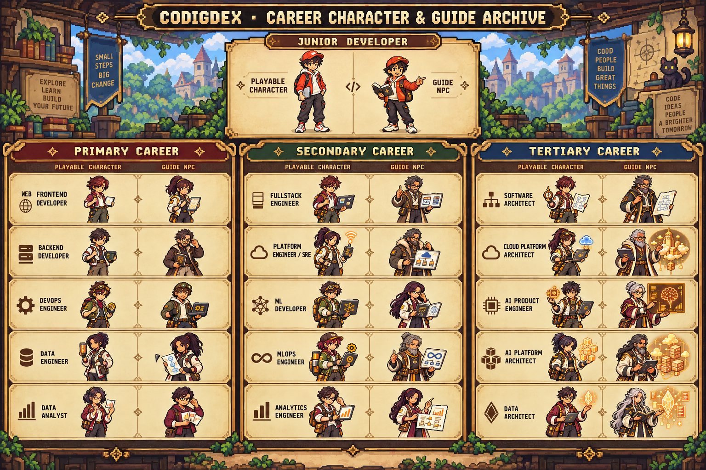
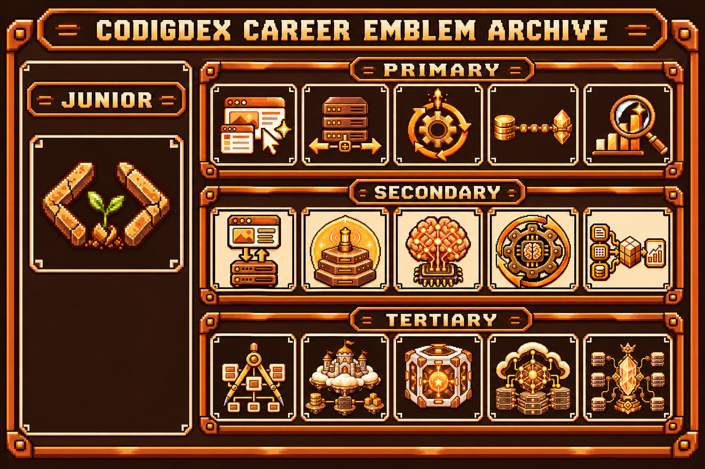

<!-- markdownlint-disable MD033 MD041 -->
<p align="center">
  
</p>

<h1 align="center">Codigdex</h1>

<p align="center">A pixel-art learning game where you defeat bug monsters and complete your own coding dex</p>
<p align="center"><a href="README.md">한국어</a> · <b>English</b></p>
<!-- markdownlint-enable MD033 MD041 -->

[](https://github.com/codingnanyong/codigdex/actions/workflows/ci.yml)
[](https://github.com/codingnanyong/codigdex/actions/workflows/pr-policy.yml)
[](https://github.com/codingnanyong/codigdex/actions/workflows/claude-review.yml)
[](https://codigdex.vercel.app)
[](LICENSE)

## What is Codigdex?

In **Codeville**, a pixel village on a server cloud, the concepts hidden in code roam around as bug monsters. Step in as a junior developer on your very first adventure, face the monsters, prove you really understand each concept, and fill your own dex: **Codigdex**.

Instead of reading and moving on, you learn to code by catching concepts one at a time.


## How to play

1. **Take a request** — a guide NPC tells you which bug monster has appeared in the area.
2. **Question battle** — attack by answering the coding questions the monster throws at you. Every right answer weakens it.
3. **Register it** — get 60% or more right to capture the monster and keep its card in your dex. Failing costs nothing, and a retry brings new questions.
4. **Move on** — each capture brings a stronger monster, and finishing a chapter opens a new region.

## Your adventure

```text
Tutorial · Loop Forest
  → CH.01 Git · Field of Records
  → CH.02 Linux · Shell Cave
  → Tier 1 promotion: Web Frontend · Backend · DevOps · Data Engineer · Data Analyst
  → Tier 2 promotion: hybrid careers that bridge two fields
  → Tier 3 promotion: master careers
```

First learn Git and Linux, the skills every developer needs, then pick a career and explore that career's own map. Each career has a senior NPC to guide you, and higher careers like Fullstack Engineer or ML Developer stay hidden behind `???`, waiting for you to walk both paths that lead to them.



## Things to collect

- **Monster dex** — from the Loop Bug to the Git Sprout and the Kernel Guardian. Every technology has monsters that evolve from Lv.1 to Lv.5. Monsters you have not discovered yet stay as `???`.
- **Career dex** — collect 16 career emblems, from junior developer to tier 3 master careers. The day you first promoted and the day you mastered each career are recorded.



## Playable now

- Collect 11 monsters across the tutorial, Git and Linux chapters
- Promote into one of 5 tier 1 careers and explore its map
- Monster dex and career dex
- Switch between Korean and English in settings

The specialist chapters for each career (HTML/CSS, Docker, SQL and more) already have their maps and monsters, and their battles are opening one by one. Your progress is saved in the browser automatically.

👉 **[Play now at codigdex.vercel.app](https://codigdex.vercel.app)**

## Run locally

Built with Next.js, Phaser and TypeScript.

```bash
npm install
npm run dev --workspace @codigdex/web
```

Open [http://localhost:3001](http://localhost:3001) in your browser. Run the tests with `npm run test`.

## Docs

- [Game Design Document](docs/eng/GAME_DESIGN.md) — game rules, screens, visual guide
- [Career Path Design](docs/eng/CAREER_PATH_DESIGN.md) — curriculum, promotion requirements, save format
- [Git workflow](docs/eng/GIT_WORKFLOW.md) — branch strategy, PR and issue automation
- [Monorepo architecture](docs/eng/MONOREPO_ARCHITECTURE.md) — web/mobile apps and shared package boundaries
- [Contributing](CONTRIBUTING.md) · [Project and PR policy](AGENTS.md)

## Contributing

This project is built and reviewed by one person, so outside pull requests are not accepted. If you spot a bug or an incorrect explanation, please let me know with an Issue. See the [contributing guide](CONTRIBUTING.md) for details.

## License

[MIT](LICENSE) © codingnanyong
