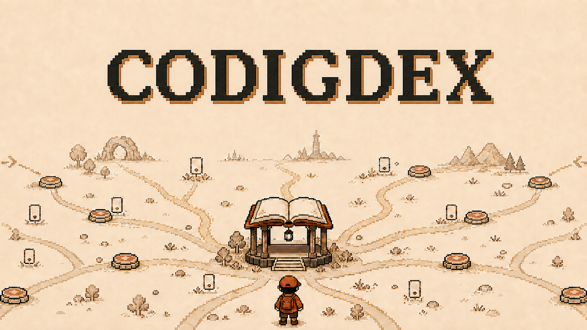

<p align="center">
  
</p>

<h1 align="center">Codigdex</h1>

<p align="center">
  A pixel-art coding-education game — beat bug monsters, pass a capture quiz, and register graded cards in your own Pokédex-style code dex.
</p>

<p align="center">
  <a href="https://github.com/codingnanyong/codigdex/actions/workflows/ci.yml"></a>
  <a href="https://github.com/codingnanyong/codigdex/actions/workflows/pr-policy.yml"></a>
  <a href="https://github.com/codingnanyong/codigdex/actions/workflows/claude-review.yml"></a>
  <a href="https://codigdex.vercel.app"></a>
  <a href="LICENSE"></a>
</p>

---

## 🎮 What is Codigdex?

Codigdex doesn't stop at *teaching* a coding concept — you have to prove you understood it. Defeat a bug monster in a code battle, pass its short capture quiz, and it's registered as a bronze/silver/gold card in your personal **Codigdex**. Filling out the dex *is* the game.

You play a junior coder in Codeville, a pixel town floating on a server cloud, hunting down bug monsters concept by concept. Miss a perfect score? Bronze and silver cards can always be re-caught for gold later — the game rewards retrying, not punishing misses.

<p align="center">
  
</p>

Built with **Next.js + Phaser.js**, deployed on **Vercel**. See [docs/GAME_DESIGN.md](docs/GAME_DESIGN.md) for the full design doc — core loop, curriculum roadmap, card/dex system, and an example playthrough of CH.01.

## ✨ Features

**🐛 Game**
- ✅ Quest → code battle → capture quiz → dex registration → reward loop, fully playable end-to-end (tutorial, "반복문의 숲")
- ✅ Block-ordering code battle minigame
- ✅ Bronze / silver / gold grading from capture-quiz accuracy, with gold-upgrade re-challenges
- ✅ Codigdex dex screen with completion % and a chapter-master badge
- ✅ Framework-free `lib/domain` game logic, unit + integration tested with Vitest

**🤖 Repo automation**
- ✅ Push a `feat/<slug>` branch → Linear issue + mirrored GitHub issue + Draft PR into `develop`, auto-created — no manual issue pairing
- ✅ Every PR validated against the Linear/GitHub issue-pair policy before it can merge
- ✅ Claude (and optionally Codex) auto-reviews every PR
- ✅ Slack notification on every merge to `develop`/`main`
- ✅ Lint, test, and build run in CI on every PR touching `web/`

## 🚀 Quick start

```bash
cd web
npm install
npm run dev
```

Open [http://localhost:3000](http://localhost:3000). Other useful scripts (run from `web/`): `npm run test`, `npm run lint`, `npm run build`.

## 📖 Documentation

- [docs/GAME_DESIGN.md](docs/GAME_DESIGN.md) — game design doc (concept, core loop, curriculum roadmap, playthrough example)
- [AGENTS.md](AGENTS.md) — project purpose + the PR/issue policy that gates every merge (source of truth for both human and agent contributors)
- [docs/kor/GIT_WORKFLOW.md](docs/kor/GIT_WORKFLOW.md) / [docs/eng/GIT_WORKFLOW.md](docs/eng/GIT_WORKFLOW.md) — human-readable branch/PR/Linear policy

## 🧑‍💻 Contributing

PRs follow `feat/<slug>` → Draft PR into `develop` → `develop` → `main`, gated by a paired Linear (`COD-n`) + GitHub (`#n`) issue — see [AGENTS.md](AGENTS.md#pr--issue-policy) for the full flow and manual fallback. Please also read [CONTRIBUTING.md](CONTRIBUTING.md), [CODE_OF_CONDUCT.md](CODE_OF_CONDUCT.md), and [SECURITY.md](SECURITY.md) for reporting vulnerabilities.

<details>
<summary><h2 style="display:inline">🧰 Setup checklist for a new repo made from this template</h2></summary>

This repo is built on codingnanyong's standard repo template: Linear/GitHub-issue-gated PR flow, Claude + Codex PR review, Slack merge notifications, and the usual community-health files, all pre-wired. The checklist below is what a *new* repo spun up from this template still needs — kept here for reference.

Everything below is a **one-time, per-repo** step — things only a human can do or decide (create accounts/keys, name the project, click "Install"). Once done, day-to-day PR/issue/Slack work is fully automated; nobody touches these again unless a key rotates or the project is renamed.

### A. What stays automated after setup (no action needed once wired up)

- Opening a `feat/<slug>` branch → Linear issue created/reused, GitHub mirror issue created/reused, Draft PR opened into `develop` — all handled by `prepare-feature-pr.yml`.
- Every PR event → branch/title/body/issue-pair validated by `pr-policy.yml`; nothing to fill in by hand.
- Merge into `develop` → mirrored GitHub issue auto-closed by `pr-policy.yml`, which auto-transitions the Linear issue to Done via Linear's own GitHub integration.
- Every PR → reviewed by `claude-review.yml` (and Codex, if installed).
- Merge into `develop`/`main` → summary posted to Slack by `notify-slack-on-merge.yml`.

### B. What you must newly do or provide for *this* repo

1. **Rename things**: update this README, `AGENTS.md`'s "Project purpose" section, and the license year/holder if needed.
2. **Create `develop` branch**: `git checkout -b develop && git push -u origin develop`, then set `develop` as the default branch in repo Settings if that's your convention (or keep `main` default and just target `develop` for feature PRs).
3. **Install the Claude GitHub App**: https://github.com/apps/claude → select this repo.
4. **(Optional) Install a Codex review app** (e.g. ChatGPT Codex Connector) via https://github.com/settings/installations if you want a second automated reviewer.
5. **Add repo secrets** (Settings → Secrets and variables → Actions → Secrets) — these are credentials only you can issue:
   - `CLAUDE_CODE_OAUTH_TOKEN` (run `claude setup-token` locally if you have a Claude subscription) or `ANTHROPIC_API_KEY`
   - `SLACK_WEBHOOK_URL` (Slack app → Incoming Webhooks, pick your notifications channel)
   - `LINEAR_API_KEY` (Linear → Settings → API → Create key)
   - `GH_PAT` — a fine-grained PAT (Contents:read, Issues:write, Pull requests:write on this repo), **not** the default `GITHUB_TOKEN`. `prepare-feature-pr.yml` uses it to create the draft PR; PRs created with `GITHUB_TOKEN` don't retrigger `pr-policy.yml` (GitHub's anti-recursion rule), so the PR would stay unchecked.
6. **Add repo variables** (Settings → Secrets and variables → Actions → Variables) — the Linear project this repo's issues live in, since that's different per repo:
   - `LINEAR_PROJECT_SLUG` — from the Linear project's "Copy link" (the last URL segment)
   - `LINEAR_PROJECT_NAME` — the project's display name, used as a fallback lookup if the slug ever changes
7. **Branch protection** (optional but recommended): require the `validate-flow` and `review` checks to pass before merging into `develop`/`main`.

Steps 5–6 are the only inputs the automation actually needs; everything after that (A above) runs itself. For the full day-to-day procedure and manual fallback if a secret expires, see [AGENTS.md](AGENTS.md#pr--issue-policy) or [CONTRIBUTING.md](CONTRIBUTING.md).

</details>

## 📄 License

[MIT](LICENSE) © codingnanyong
