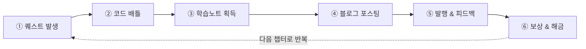
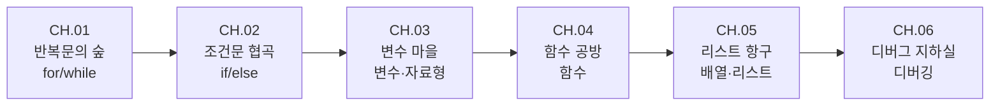

# Codidex 게임 기획서 (v0.1)

> 픽셀 아트 코딩 교육 게임 · 핵심 메커니즘: 블로그 포스팅
> 작성일: 2026-09-07 · 기술 스택: Next.js + Phaser.js → Vercel 배포
> 인터랙티브 버전(다이어그램 포함): https://claude.ai/code/artifact/75ffe799-5666-468f-80b8-94f5b00955ce

이 문서는 위 인터랙티브 기획서의 내용을 저장소에 영구 보관하기 위한 마크다운 스냅샷이다. 기획이 바뀌면 이 파일을 1차 소스로 갱신한다.

## 목차

1. [핵심 컨셉](#1-핵심-컨셉)
2. [게임 루프](#2-게임-루프)
3. [세계관 & 톤](#3-세계관--톤)
4. [화면 구성](#4-화면-구성)
5. [예시 플레이스루 — CH.01 반복문의 숲](#5-예시-플레이스루--ch01-반복문의-숲)
6. [블로그 시스템](#6-블로그-시스템)
7. [커리큘럼 로드맵](#7-커리큘럼-로드맵)
8. [진행 & 보상 시스템](#8-진행--보상-시스템)
9. [비주얼 스타일 가이드](#9-비주얼-스타일-가이드)
10. [다음 단계](#10-다음-단계)

## 1. 핵심 컨셉

Codidex는 코딩 개념을 **배우는 것**에서 끝내지 않는다. 개발자의 학습 습관을 그대로 게임의 뼈대로 옮긴 픽셀 어드벤처다.

플레이어는 코드빌(Codeville)이라는 픽셀 마을에 사는 주니어 코더가 되어, 마을 곳곳에 출몰하는 버그 몬스터를 코드로 물리치고, 그 과정에서 얻은 깨달음을 자신의 블로그 "Codidex"에 포스팅한다. 이 게임에서 글쓰기는 부가 콘텐츠가 아니라 전투와 동등한 **메인 루프**다.

**핵심 디자인 원칙**

1. **설명할 수 있어야 안다** — 블로그 포스팅은 이해도를 확인하는 체크포인트다.
2. **블로그가 곧 성장 그래프** — 방문자·좋아요·이웃 수가 캐릭터 스탯으로 환산된다.
3. **실패해도 다시 쓴다** — 포스트는 언제든 수정·재발행 가능. 처벌보다 반복을 장려한다.

## 2. 게임 루프

한 사이클은 6단계로 돈다. 5단계까지 순서대로 진행되고, 6단계 보상 이후 다음 챕터가 열리며 다시 1단계로 돌아간다.



| 단계 | 내용 |
|---|---|
| ① 퀘스트 발생 | 지역 NPC가 코딩 문제를 몬스터 형태로 제시 |
| ② 코드 배틀 | 코드 조각을 조합/디버깅해 몬스터 처치 |
| ③ 학습노트 획득 | 방금 쓴 개념이 요약 카드로 자동 드롭 |
| ④ 블로그 포스팅 | 빈칸 채우기 + 직접 서술로 포스트 작성 |
| ⑤ 발행 & 피드백 | 자동 채점 + 이웃 블로거 NPC 댓글 |
| ⑥ 보상 & 해금 | EXP·코인·아이템 지급, 다음 지역 개방 |

## 3. 세계관 & 톤

배경은 구름 위에 떠 있는 작은 서버 섬 **코드빌(Codeville)**. 플레이어는 이제 막 개발을 시작한 "주니어 코더" 아바타로, 마을 곳곳의 버그 몬스터를 물리치며 자신의 방 한켠 낡은 컴퓨터로 블로그 Codidex를 운영한다.

- **이웃 블로거 NPC** — 프론트엔드 요정, 백엔드 드워프, 알고리즘 마법사 등 각기 다른 스택의 선배들이 댓글로 힌트와 응원을 남긴다.
- **톤앤매너** — 스타듀밸리류의 따뜻한 코지함 + 레트로 터미널 감성.
- **유머 장치** — 무한루프에 걸린 슬라임은 잡을 때까지 같은 대사만 반복하는 식으로, 개념 자체를 개그로 쓴다.

## 4. 화면 구성

| 화면 | 설명 | 핵심 요소 |
|---|---|---|
| 월드맵 | 코드빌을 자유 이동하며 지역별 퀘스트 몬스터와 조우 | 지역 잠금/해금, NPC 힌트, 미니맵 |
| 코드 배틀 | 코드 조각을 배치해 실행 결과로 몬스터 공격 | 블록 팔레트, 몬스터 HP, 힌트 토큰 |
| 블로그 에디터 | 레트로 CMS 느낌의 포스트 작성 화면 | 제목/본문/빈칸 채우기, 미리보기, 발행 |
| 블로그 프로필 | 발행 포스트·방문자·이웃 댓글·성장 그래프 확인 | 포스트 타임라인, 댓글 피드, 레벨/배지 |

## 5. 예시 플레이스루 — CH.01 반복문의 숲

`for` 반복문을 가르치는 첫 챕터를 처음부터 끝까지 따라간다.

1. **퀘스트 발생** — NPC 루피: "무한루프 슬라임들이 우물을 막고 있어요. 같은 동작을 정확히 5번 반복하는 주문이 필요해요!"
2. **코드 배틀** — 블록 `for` / `i in range(5)` / `물_긷기()` 를 순서대로 배치.
   ```python
   for i in range(5):
       물_긷기()  # 슬라임 5마리에게 각각 정화의 물 투척
   ```
3. **학습노트 획득** — "for 반복문 — 정해진 횟수만큼 같은 동작을 반복 실행하는 문법. `range(5)`는 0부터 4까지 5번을 의미한다."
4. **블로그 포스팅** — 초안의 빈칸을 채워 완성:
   - 제목: 오늘 배운 것 — **for** 반복문으로 슬라임 잡기
   - 본문: 오늘은 **for** 문을 이용해서 같은 행동을 **5**번 반복하는 법을 배웠다. 이건 마치 **빨래를 다섯 번 헹구는 것**처럼, 정해진 횟수만큼 같은 일을 되풀이할 때 쓴다.
5. **발행 & 피드백** — 자동 채점 통과. 이웃 "알고리즘 마법사" 댓글: "우와, 저도 이 슬라임 때문에 고생했는데 덕분에 이해했어요! 비유가 찰떡이네요 👍"
6. **보상 & 해금** — EXP +50 · 코인 +20 · 방문자 +34 · 좋아요 +12 · "반복문 마스터" 배지 · 다음 지역(조건문 협곡) 해금

## 6. 블로그 시스템

세 가지 포스트 타입을 중심으로 돌아간다.

| 타입 | 이름 | 설명 |
|---|---|---|
| A | 오늘 배운 것 | 퀘스트 클리어 직후, 방금 배운 개념을 요약·설명하는 기본 포스트 |
| B | 트러블슈팅 일지 | 디버깅 퀘스트에서 실수와 해결 과정을 기록하는 회고형 포스트 |
| C | 프로젝트 자랑 | 챕터 보스전 클리어 후 완성한 미니 프로젝트를 소개하는 포스트 |

**채점 & 등급**: 핵심 키워드 포함 여부, 빈칸 코드의 정확성, 최소 분량을 기준으로 **브론즈 / 실버 / 골드** 등급을 매긴다. 등급이 높을수록 방문자·좋아요 증가폭이 커진다. 이웃 블로거 NPC는 오답에 가까운 설명에는 완곡한 반박 댓글로 힌트를 주고, 잘 쓴 설명에는 구체적인 칭찬으로 반응한다.

## 7. 커리큘럼 로드맵

파일럿 범위는 6개 챕터.



| 챕터 | 지역명 | 코딩 개념 | 보스 몬스터 | 예시 블로그 포스트 제목 |
|---|---|---|---|---|
| CH.01 | 반복문의 숲 | for / while | 무한루프 슬라임 | "for 반복문으로 슬라임 잡기" |
| CH.02 | 조건문 협곡 | if / else | 갈림길 고블린 | "if/else로 갈림길 뚫기" |
| CH.03 | 변수 마을 | 변수 · 자료형 | 타입에러 유령 | "변수 상자에 이름표 붙이기" |
| CH.04 | 함수 공방 | 함수 정의 · 호출 | 반복작업 골렘 | "함수로 반복 작업 자동화하기" |
| CH.05 | 리스트 항구 | 배열 · 리스트 | 인덱스 크라켄 | "리스트로 물건 정리하기" |
| CH.06 | 디버그 지하실 | 디버깅 · 에러 읽기 | 널포인터 보스 | "에러 메시지 읽는 법 정리" |

## 8. 진행 & 보상 시스템

- **EXP · 레벨** — 퀘스트와 포스팅으로 누적, 레벨업 시 캐릭터 외형(모자·안경·책상 소품) 해금
- **코인** — 블로그 테마 스킨 구매(레트로 GeoCities풍 → 미니멀 풍 등)
- **방문자 · 좋아요** — 누적치에 따라 "인기 블로거" 칭호와 랭킹 진입
- **배지 컬렉션** — 개념별 마스터리를 증명하는 수집 요소, 프로필에 상시 노출

## 9. 비주얼 스타일 가이드

캐릭터 스프라이트는 16×16, 타일은 32×32를 기준 해상도로 삼는다. 인게임 아트는 채도 높은 제한 팔레트를 쓰고, 블로그 에디터 화면만 의도적으로 모노스페이스 텍스트 UI로 대비를 준다.

**인게임 아트 팔레트 (제안)**

| 색상 | HEX |
|---|---|
| 잉크 (텍스트/외곽선) | `#1B2420` |
| 딥 틸 (블로그/코드 액센트) | `#1F6F5C` |
| 브라이트 민트 (하이라이트) | `#4FCBA8` |
| 러스트 오렌지 (퀘스트/액션 액센트) | `#E8622C` |
| 앰버 (보상/코인) | `#FFC85C` |
| 페일 민트 (배경/종이) | `#F2F6F1` |
| 슬레이트 블루 (보조) | `#5B7A8C` |
| 나이트 (다크 배경) | `#0F1613` |

## 10. 다음 단계

먼저 CH.01(반복문의 숲) 하나만으로 전체 루프가 재미있는지 검증하는 파일럿을 만든다.

**MVP — CH.01 파일럿**

- [ ] 월드맵 최소 구현 (지역 1개)
- [ ] 코드 배틀 미니게임 1종
- [ ] 블로그 에디터 + 키워드 채점
- [ ] NPC 댓글 3~5개 고정 세트
- [ ] EXP/코인/배지 지급 로직

**이후 확장**

- [ ] CH.02~06 콘텐츠 확장
- [ ] 자동 채점 고도화 (LLM 채점 검토)
- [ ] 다른 플레이어 블로그 방문 · 랭킹
- [ ] 블로그 테마 스킨 상점
- [ ] 모바일 대응 검토
