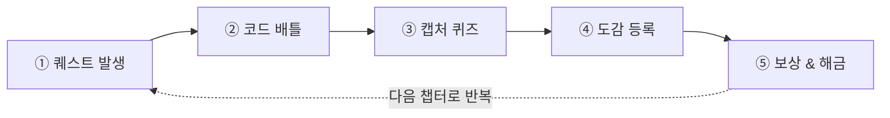
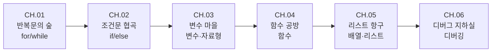

# Codidex 게임 기획서 (v0.2)

> 픽셀 아트 코딩 교육 게임 · 핵심 메커니즘: 코딩 개념 수집(도감)
> 작성일: 2026-09-07 · 기술 스택: Next.js + Phaser.js → Vercel 배포
> 인터랙티브 버전(다이어그램 포함): https://claude.ai/code/artifact/75ffe799-5666-468f-80b8-94f5b00955ce

이 문서는 위 인터랙티브 기획서의 내용을 저장소에 영구 보관하기 위한 마크다운 스냅샷이다. 기획이 바뀌면 이 파일을 1차 소스로 갱신한다.

> **v0.2 변경 사항**: 핵심 메커니즘을 "블로그 포스팅"에서 "포켓몬 도감식 수집"으로 전면 변경. Codidex는 이제 게임 제목이자, 플레이어가 채워나가는 개인 도감 그 자체를 가리킨다.

## 목차

1. [핵심 컨셉](#1-핵심-컨셉)
2. [게임 루프](#2-게임-루프)
3. [세계관 & 톤](#3-세계관--톤)
4. [화면 구성](#4-화면-구성)
5. [예시 플레이스루 — CH.01 반복문의 숲](#5-예시-플레이스루--ch01-반복문의-숲)
6. [카드 & 도감 시스템](#6-카드--도감-시스템)
7. [커리큘럼 로드맵](#7-커리큘럼-로드맵)
8. [진행 & 보상 시스템](#8-진행--보상-시스템)
9. [비주얼 스타일 가이드](#9-비주얼-스타일-가이드)
10. [다음 단계](#10-다음-단계)

## 1. 핵심 컨셉

Codidex는 코딩 개념을 **배우는 것**에서 끝내지 않는다. 버그 몬스터를 물리치는 것만으로는 부족하고, 그 개념을 정말 이해했는지 캡처 퀴즈로 증명해야 비로소 나만의 도감 **Codidex**에 정식으로 등록(캡처)된다 — 포켓몬 도감처럼, 코딩 개념을 하나씩 수집해 완성해나가는 픽셀 어드벤처다.

플레이어는 코드빌(Codeville)이라는 픽셀 마을에 사는 주니어 코더가 되어, 마을 곳곳에 출몰하는 버그 몬스터를 코드로 물리치고, 캡처 퀴즈를 통과해 자신의 도감에 등록한다. **도감을 완성하는 것 자체가 게임의 최종 목표**다.

**핵심 디자인 원칙**

1. **처치만으론 부족하다** — 캡처 퀴즈를 통과해야 정식으로 도감에 등록(캡처)된다.
2. **도감 완성률이 곧 성장 그래프** — 등록한 카드 수·등급이 캐릭터 성장 지표가 된다.
3. **놓쳐도 다시 잡는다** — 브론즈·실버 등급 카드는 해당 몬스터를 재조우해 골드까지 업그레이드할 수 있다. 처벌보다 재도전을 장려한다.

## 2. 게임 루프

한 사이클은 5단계로 돈다. 4단계까지 순서대로 진행되고, 5단계 보상 이후 다음 챕터가 열리며 다시 1단계로 돌아간다.



| 단계 | 내용 |
|---|---|
| ① 퀘스트 발생 | 지역 NPC가 코딩 문제를 몬스터 형태로 제시 |
| ② 코드 배틀 | 코드 조각을 조합/디버깅해 몬스터 처치 |
| ③ 캡처 퀴즈 | 처치 직후 짧은 빈칸·객관식 문제로 이해도 확인 |
| ④ 도감 등록 | 정답률에 따라 브론즈·실버·골드 카드로 Codidex에 등록 |
| ⑤ 보상 & 해금 | EXP·코인·아이템 지급, 다음 지역 개방 |

## 3. 세계관 & 톤

배경은 구름 위에 떠 있는 작은 서버 섬 **코드빌(Codeville)**. 플레이어는 이제 막 개발을 시작한 "주니어 코더" 아바타로, 마을 곳곳의 버그 몬스터를 물리치며 자신만의 코딩 도감 Codidex를 채워나간다.

- **동료 콜렉터 NPC** — 프론트엔드 요정, 백엔드 드워프, 알고리즘 마법사 등 각기 다른 스택의 선배들이 힌트를 주고, 서로의 도감 완성도를 비교하며 응원·경쟁한다.
- **톤앤매너** — 스타듀밸리류의 따뜻한 코지함 + 포켓몬류의 수집 성취감 + 레트로 터미널 감성.
- **유머 장치** — 무한루프에 걸린 슬라임은 잡을 때까지 같은 대사만 반복하는 식으로, 개념 자체를 개그로 쓴다.

## 4. 화면 구성

| 화면 | 설명 | 핵심 요소 |
|---|---|---|
| 월드맵 | 코드빌을 자유 이동하며 지역별 퀘스트 몬스터와 조우 | 지역 잠금/해금, NPC 힌트, 미니맵 |
| 코드 배틀 | 코드 조각을 배치해 실행 결과로 몬스터 공격 | 블록 팔레트, 몬스터 HP, 힌트 토큰 |
| 캡처 퀴즈 | 몬스터 처치 직후 뜨는 짧은 이해도 확인 팝업 | 빈칸/객관식 2~3문항, 정답률 게이지, 등급 판정 |
| Codidex (도감) | 수집한 카드 목록과 전체 완성률 확인 | 카드 그리드, 등급 필터, 완성률(%), 콜렉터 랭크 |

## 5. 예시 플레이스루 — CH.01 반복문의 숲

`for` 반복문을 가르치는 첫 챕터를 처음부터 끝까지 따라간다.

1. **퀘스트 발생** — NPC 루피: "무한루프 슬라임들이 우물을 막고 있어요. 물리치고 도감에 등록해주세요!"
2. **코드 배틀** — 블록 `for` / `i in range(5)` / `물_긷기()` 를 순서대로 배치.
   ```python
   for i in range(5):
       물_긷기()  # 슬라임 5마리에게 각각 정화의 물 투척
   ```
3. **캡처 퀴즈** — 처치 직후 팝업으로 2문제 출제.
   - Q1 (객관식): `for i in range(5):` 는 몇 번 반복되나요? → 정답 **5**
   - Q2 (빈칸): `____ i in range(5):` → 정답 **for**
   - 2문제 모두 정답 → 골드, 1문제 정답 → 실버, 0문제 → 브론즈(재도전 가능)
4. **도감 등록** — "무한루프 슬라임" 카드가 **골드** 등급으로 Codidex에 등록. 카드 뒷면 설명: "for 반복문 — 정해진 횟수만큼 같은 동작을 반복 실행하는 문법. `range(5)`는 0부터 4까지 5번을 의미한다."
5. **보상 & 해금** — EXP +50 · 코인 +20 · 도감 완성률 +1칸. 동료 콜렉터 "알고리즘 마법사"의 반응: "오, 골드로 잡았네! 나도 저번에 실버로 겨우 잡았었는데 ㅋㅋ" · 다음 지역(조건문 협곡) 해금.

## 6. 카드 & 도감 시스템

Codidex는 몬스터(=코딩 개념) 한 마리당 카드 한 장으로 구성된다.

- **카드 구성**: 몬스터 픽셀 일러스트 + 개념 이름 + 한 줄 설명 + 예시 코드 스니펫 + 최초 캡처일
- **등급**: 캡처 퀴즈 정답률에 따라 **브론즈 / 실버 / 골드** 3단계. 등급이 높을수록 도감 완성률에 더 크게 기여한다.
- **재도전**: 브론즈·실버로 등록된 카드는 해당 몬스터를 재조우해 캡처 퀴즈를 다시 풀면 골드까지 업그레이드할 수 있다.
- **챕터 마스터 보너스**: 한 챕터의 모든 카드를 골드로 채우면 해당 챕터의 "챕터 마스터" 특별 배지 카드를 획득한다.

## 7. 커리큘럼 로드맵

파일럿 범위는 6개 챕터.



| 챕터 | 지역명 | 코딩 개념 | 보스 몬스터(=카드) | 캡처 퀴즈 예시 |
|---|---|---|---|---|
| CH.01 | 반복문의 숲 | for / while | 무한루프 슬라임 | "`for i in range(5):`는 몇 번 반복되나요?" |
| CH.02 | 조건문 협곡 | if / else | 갈림길 고블린 | "조건이 거짓일 때 실행되는 블록은?" |
| CH.03 | 변수 마을 | 변수 · 자료형 | 타입에러 유령 | "`\"5\" + 3`이 에러인 이유는?" |
| CH.04 | 함수 공방 | 함수 정의 · 호출 | 반복작업 골렘 | "함수를 다시 실행하려면 무엇이 필요한가요?" |
| CH.05 | 리스트 항구 | 배열 · 리스트 | 인덱스 크라켄 | "리스트의 첫 번째 요소는 인덱스 몇 번?" |
| CH.06 | 디버그 지하실 | 디버깅 · 에러 읽기 | 널포인터 보스 | "에러 메시지에서 가장 먼저 봐야 할 줄은?" |

## 8. 진행 & 보상 시스템

- **EXP · 레벨** — 퀘스트와 캡처로 누적, 레벨업 시 캐릭터 외형(모자·안경·책상 소품) 해금
- **코인** — Codidex 커버·카드 프레임 스킨 구매(레트로 도감풍 → 홀로그램풍 등)
- **도감 완성률** — 등록한 카드 수·등급에 따라 누적, 완성률에 따라 "마스터 콜렉터" 칭호와 랭킹 진입
- **배지 컬렉션** — 챕터 마스터 등 특별 배지 카드, 프로필에 상시 노출

## 9. 비주얼 스타일 가이드

캐릭터 스프라이트는 16×16, 타일은 32×32를 기준 해상도로 삼는다. 인게임 아트는 채도 높은 제한 팔레트를 쓰고, 캡처 퀴즈 화면만 의도적으로 모노스페이스 텍스트 UI로 대비를 준다.

**인게임 아트 팔레트 (제안)**

| 색상 | HEX |
|---|---|
| 잉크 (텍스트/외곽선) | `#1B2420` |
| 딥 틸 (도감/코드 액센트) | `#1F6F5C` |
| 브라이트 민트 (하이라이트) | `#4FCBA8` |
| 러스트 오렌지 (퀘스트/액션 액센트) | `#E8622C` |
| 앰버 (보상/코인) | `#FFC85C` |
| 페일 민트 (배경/종이) | `#F2F6F1` |
| 슬레이트 블루 (보조) | `#5B7A8C` |
| 나이트 (다크 배경) | `#0F1613` |

## 10. 다음 단계

먼저 CH.01(반복문의 숲) 하나만으로 전체 루프가 재미있는지 검증하는 파일럿을 만든다.

**MVP — CH.01 파일럿**

- [ ] 월드맵 최소 구현 (지역 1개)
- [ ] 코드 배틀 미니게임 1종
- [ ] 캡처 퀴즈 UI + 등급 채점 로직
- [ ] 동료 콜렉터 NPC 반응 3~5개 고정 세트
- [ ] Codidex 도감 화면 (카드 그리드 뷰)
- [ ] EXP/코인/배지 지급 로직

**이후 확장**

- [ ] CH.02~06 콘텐츠 확장
- [ ] 캡처 퀴즈 문제 자동 생성 (LLM 출제 검토)
- [ ] 다른 플레이어 도감 비교 · 랭킹
- [ ] 카드 프레임 스킨 상점
- [ ] 모바일 대응 검토
