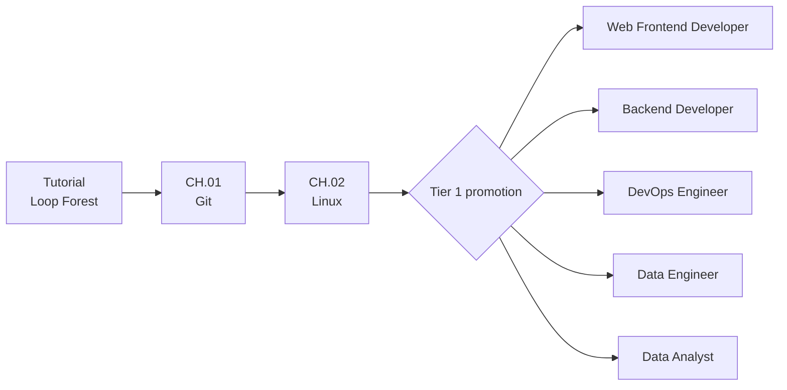
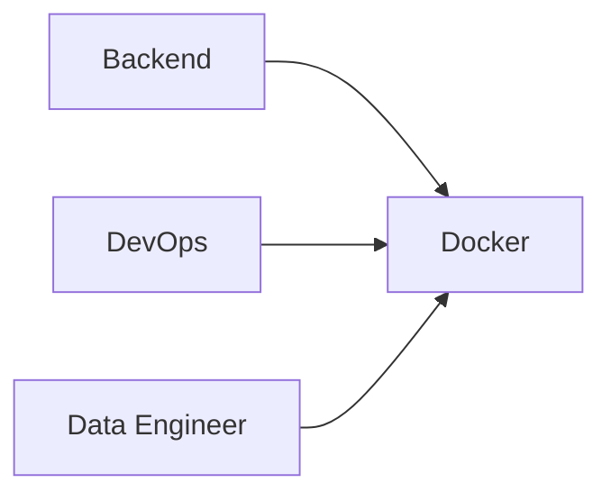

# Codigdex Career Path Design

[한국어](../kor/CAREER_PATH_DESIGN.md) · **English**

The Codigdex learning journey runs **tutorial → junior common path → tier 1 promotion → career specialist courses → tier 2 and tier 3 promotion**. This document is the reference for expanding game content, and also the source material for blog posts introducing the developer learning roadmap.

> Last updated: 2026-09-15. Each section describes the current implementation, and parts without content yet are marked **(planned)**. Game-wide rules follow the [Game Design Document](GAME_DESIGN.md). The game supports Korean and English; English names here match the English UI, with the Korean original in parentheses where it helps.

## Overall structure



The tutorial is not a regular chapter. It uses loop questions to let the player experience the core loop first: request, question battle, dex entry. The regular curriculum starts at `CH.01 Git`.

## Junior common path

| Order | Course | Region | Why everyone learns it |
| --- | --- | --- | --- |
| CH.01 | Git | Field of Records (기록의 들판) | Tracking changes, collaborating and recovering are baseline skills for every developer role. |
| CH.02 | Linux | Shell Cave (셸 동굴) | Understanding files, paths, permissions, processes and running commands lets players handle later dev tools on their own. |
| Promotion | Pick a tier 1 career | Career lineage screen | With a minimal shared foundation in place, the player enters the specialist course they care about. |

The common path stays short. If every technology became a promotion requirement, players could burn out before ever reaching the role they are interested in.

### Stages inside a chapter

Each common-path chapter is not a single monster but **five stages, Lv.1 to Lv.5**. On the world map, Lv.1–Lv.4 circle the region and Lv.5 sits in the center as the mastery encounter. After capturing a stage, the field player walks along the terrain-following route to the next stage's checkpoint.

- Capturing a stage opens the next one; capturing the last stage opens the next chapter.
- Every stage has one dex slot and 20 topic questions.
- A battle draws level + 2 questions (Lv.1 asks 3 → Lv.5 asks 7).
- Answering at least 60% of the drawn questions (rounded up) captures the monster (Lv.1 2/3 · Lv.2 3/4 · Lv.3 3/5 · Lv.4 4/6 · Lv.5 5/7).
- The battle ends the moment the target is reached or becomes unreachable.

Requiring every answer to be correct is not used: for beginners a single mistake would mean failure, which is far too harsh.

| Chapter | Lv.1 | Lv.2 | Lv.3 | Lv.4 | Lv.5 |
| --- | --- | --- | --- | --- | --- |
| CH.01 Git (`001–005`) | Git Sprout (깃새싹) · repository basics | Branch Twins (브랜치 쌍둥이) · branch and merge | Conflict Rewinder (충돌 되돌이) · conflicts and undoing | Remote Rebaser (원격 리베이서) · remotes and rebase | Workflow Guardian (워크플로 수호자) · PR, review, CI |
| CH.02 Linux (`006–010`) | Shell Scout (셸 탐험가) · shell basics | Path Forager (경로 채집가) · paths and files | Permission Guard (권한 수호병) · permissions and users | Pipe Engineer (파이프 엔지니어) · pipes and processes | Kernel Guardian (커널 수호자) · kernel and boot |

Chapter specimens (`git-specimen`, `linux-specimen`) are the chapter icons on the Path map; battles use the per-stage monsters.

### Entering tier 1 promotion

The first capture of CH.02 Lv.5 shows a "Common path complete!" notice on the result panel, and confirming it goes to the career lineage screen instead of the world map. A save that finished the common path but has not picked a career yet is also sent to the promotion screen on its next visit. Before a promotion is confirmed, a dialog shows the player's career character and the guide NPC side by side.

## Why Docker is not on the common path

Docker is important, but it is not a fundamental that every beginner role needs at the same time and depth. Containers are learned best once the player understands the terminal, processes, networking and running servers.

So Docker is designed as a **shared specialist region** that several careers meet again after promotion.



Frontend developers and data analysts can still learn Docker optionally, but it is never a requirement that blocks promotion.

## Career detail maps

After promotion, each career's v3 wallpaper detail map lays out its technology regions in order. That order is the recommended learning order.

| Career | Guide NPC | Technology regions (map order) | Count |
| --- | --- | --- | ---: |
| Web Frontend Developer | UI Alchemist Mina (UI 연금술사 미나) | HTML/CSS → JavaScript → Browser · HTTP → React → Frontend testing | 5 |
| Backend Developer | Server Guardian Taeo (서버 수호자 태오) | HTTP/API → Server framework → Database · SQL → Auth · Security → Networking → Docker | 6 |
| DevOps Engineer | Automation Artisan Doyun (자동화 장인 도윤) | Networking → Docker → CI/CD → Kubernetes → Cloud · IaC → Monitoring | 6 |
| Data Engineer | Pipeline Architect Hana (파이프라인 설계자 하나) | Python → SQL · Data modeling → Data pipelines → Docker → Orchestration → Monitoring | 6 |
| Data Analyst | Insight Detective Ian (인사이트 탐정 이안) | SQL → Basic statistics → Data visualization → BI tools → Python for analysis | 5 |

Regions are defined in `web/lib/phaser/worldMap/careerPaths.ts`. All 28 technology regions have their maps and monster art ready; battle and question content is **(planned)**.

### Map depth and navigation

The Path screen and the play regions are different screens. The Path map is a roadmap showing the common path and promotion relationships; picking a tier 1 career turns the world map into that career's **detail map**. Tapping a technology region on the detail map opens a zoomed-in **technology region screen**, where the guide NPC introduces the collecting ground. The link from a technology region to monster battles will be added with the specialist chapter content **(planned)**.

```text
Path map → career detail map → technology region → battle/capture (planned)
```

Each career wallpaper already paints the routes and landmarks. Instead of numbered discs, the UI adds invisible hit areas fitted to each building's or island's real outline, plus an `order · technology` label. Hovering a region lifts only a transparent texture cut from the wallpaper along that region's outline (`<career>-<region>-terrain-v3.png`), adds a shadow beneath it, and shows the region name in the middle of the map. The hit area (`focusPoints`) is deliberately generous, while the lifted silhouette (`lift`) is defined separately to hug the building's outline. No rectangle or polygon outline is drawn, and the wallpaper itself never moves. The bottom of the map shows the guide NPC, the current career's field character (`MY PLAYER`), and the tier 2 `◆ ???` slot.

So adding a new chapter does not mean redrawing the Path map: add the destination's focus area to the detail map data, then connect that destination to the chapter region.

### Characters and guide NPCs

Bug researcher Lupi (루피) guides the common path before promotion. After promotion, each career's senior NPC takes over on the detail map and appears as a half-body portrait at the bottom of the dialog. Changing careers swaps the map and NPC immediately along with the saved tier 1 career.

| Asset | Path | Used for |
| --- | --- | --- |
| Career full-body character | `assets/characters/career-path/<career-id>/player-v2.png` | Career lineage list, promotion confirmation dialog |
| Guide NPC | `assets/characters/career-path/<career-id>/guide-v1.png` | Dialog portrait |
| Field player (junior) | `assets/characters/player/overworld-player-v1.png` | Walking common-path chapter routes |
| Field player (tier 1 career) | `assets/characters/career-path/<career-id>/overworld-v1.png` | Walking the world map after promotion, detail map `MY PLAYER` |
| Character sheet | `assets/characters/career-path/career-character-guide-v2.png` | Archive of players and guides from junior to tier 3 |
| Career emblem | `assets/career-emblems/<career-id>-v1.png` | Career dex (16 emblems) |

## Technologies shared between careers

Career paths are not five fully separate lines. They form a crossing tree where different careers meet the same technology in different contexts. The table below lists the shared regions actually placed on today's detail maps.

| Shared technology | Careers whose maps include it |
| --- | --- |
| HTTP · API | Web Frontend, Backend |
| SQL · Databases | Backend, Data Engineer, Data Analyst |
| Python | Data Engineer, Data Analyst |
| Docker | Backend, DevOps, Data Engineer |
| Networking | Backend, DevOps |
| Monitoring | DevOps, Data Engineer |

The `paths` field in the technology specimen definitions (`web/lib/domain/technologySpecimens.ts`) already records wider links than this. For example, testing and CI/CD are linked to Frontend, Backend and DevOps, and Cloud · IaC and Kubernetes to Backend, DevOps and Data Engineer. Use that list as the reference when adding regions to a map.

Captures go into one dex regardless of career, so a player who captured a shared technology first keeps that card after promoting into another career. This avoids forcing players to relearn and gives them a reason to explore other roles.

## Changing tier 1 careers

- As a junior, the player can pick any of the five tier 1 careers.
- Once a tier 1 career is picked, the player cannot switch to another tier 1 career until that career's path is complete (MASTER). Other careers show as `locked` on the lineage screen, and tapping one explains that the current career's chapters must all be completed first.
- Path completion is computed by checking that every capture in the career's final capture list (`completionCaptureIds`) is in the dex. An empty list never counts as complete.
- Every tier 1 career currently has an empty `completionCaptureIds`, so **the first career choice stays fixed until specialist chapters ship.** A second tier 1 career and tier 2 promotion only open for real once that content is released.

## Tier 2 promotion (hybrid careers)

Completing two tier 1 career paths opens a tier 2 career that bridges both fields. Together with the rule that shared cards are kept, this gives a player who finished one career a reason to explore another. Integration chapter content will be built once the required tier 1 paths are complete **(planned)**.

The career lineage screen shows four columns from left to right: **pre-promotion junior developer → tier 1 → tier 2 → tier 3**. Lines branch from the junior card to every tier 1 career, and each tier 1 career connects to the tier 2 careers it can combine into. The name and selection of a tier 2 career are revealed only when the set of tier 1 careers with a MASTER record covers that career's `requires` pair. For example, completing Frontend and Backend opens Fullstack Engineer, but Platform Engineer / SRE stays locked until DevOps is also complete. Each tier 2 career links horizontally to exactly one tier 3 career so the full lineage never tangles.

| Tier 2 career | Guide NPC | Unlock requirement | Integration chapter topics (examples) |
| --- | --- | --- | --- |
| Fullstack Engineer | Boundary Architect Ara (경계의 설계자 아라) | Web Frontend + Backend | Connecting UI and APIs, auth, deployment |
| Platform Engineer / SRE | Platform Navigator Jun (플랫폼 항해사 준) | Backend + DevOps | Service delivery pipelines, observability, incident response |
| ML Developer | Model Tamer Yujin (모델 조련사 유진) | Backend + Data Engineer | Model serving, inference APIs, data and model pipelines |
| MLOps Engineer | Model Operator Siwoo (모델 운영관 시우) | DevOps + Data Engineer | Containerized pipelines, scheduling, monitoring |
| Analytics Engineer | Metrics Translator Sora (지표 번역가 소라) | Data Engineer + Data Analyst | Data modeling, transformation, metric definitions |

- **Only combinations with a real job title exist.** Building all 10 combinations of five tier 1 careers would add content while blurring what each career means.
- **Reveal like a dex silhouette.** The lineage screen and detail map show only a `◆ ???` slot. The detail map slot only says the identity is revealed after completing another tier 1 career path, while the lineage and Path map slots state the requirement, e.g. "Opens after completing both `<Career A> + <Career B>` paths." Hiding them entirely would leave players unaware they exist, with no motivation to reach them.
- **Future monsters also hold a dex slot.** Specialist monsters without battles yet show only a number and `???`. Undiscovered slots do not count toward the dex's registered total or completion.
- **Not just a title.** Each tier 2 career comes with a five-stage integration chapter bridging both fields, its own guide NPC and a career emblem.
- **Unlocks are recomputed from records.** Tier 1 path completion is verified from captures and then stored as a MASTER record in the career dex; tier 2 and tier 3 unlocks are computed from those records. Changing the selected tier 2 career clears the selected tier 3 career.

Following the career production order (DevOps → Backend → Data Engineer → Web Frontend → Data Analyst), Platform Engineer opens first (once the Backend path is done), and Fullstack Engineer opens after the Web Frontend path is complete.

## Tier 3 promotion (master careers)

Tier 3 does not require another career combination. It opens once the player completes the mastery path and final project of their selected tier 2 career. The lineage screen attaches exactly one tier 3 career beside each tier 2 career, so the connecting lines stay simple.

A tier 2 career whose mastery chapter has not shipped keeps its requirement (`masteryCaptureIds`) as an empty array. That state is not treated as a completed tier 2 path, and the tier 3 card stays a `???` preview. Tapping a locked tier 3 card says it opens after completing the `<tier 2 career>` mastery path.

| Tier 2 career | Tier 3 career | Guide NPC |
| --- | --- | --- |
| Fullstack Engineer | Software Architect | System Sage Rohan (시스템 대현자 로한) |
| Platform Engineer / SRE | Cloud Platform Architect | Cloud Citadel Architect Haneul (구름 성채 설계자 하늘) |
| ML Developer | AI Product Engineer | AI Workshop Master Jian (AI 공방장 지안) |
| MLOps Engineer | AI Platform Architect | Intelligence Foundation Architect Leon (지능 기반 설계자 레온) |
| Analytics Engineer | Data Architect | Data Archivist Seoyun (데이터 기록관 서윤) |

## Career dex

The `Career` tab in Codigdex collects all 16 careers from junior to tier 3, numbered from `JOB.000`. Each record holds these timestamps:

| Field | Recorded when |
| --- | --- |
| `unlockedAt` | The career unlocks. Junior from the start, tier 1 careers when the common path is complete, tier 2 when both tier 1 careers reach MASTER, tier 3 when the matching tier 2 career reaches MASTER |
| `selectedAt` | The player first promotes into that career |
| `masteredAt` | The player completes that career's path. For junior, when the common path is complete |

The screen shows locked · available · current · MASTER states and a `registered n/16 · MASTER m` summary. Recorded timestamps are never cleared, so a previous career's first-promotion and MASTER history survives a career change.

## Save format

The browser save lives in a single `localStorage` slot, `codigdex:save:v3`. Instead of piling frequently changing screen state into one flat object, it is split into `progress`, `player` and `ui`. The schema and migrations are in `web/lib/phaser/save/schema.ts`.

```ts
{
  version: 3,
  progress: {
    captures: [{ id, capturedAt }],                            // monster captures
    careers: [{ id, unlockedAt, selectedAt?, masteredAt? }],   // career dex history
  },
  player: { primaryJobId, secondaryJobId, tertiaryJobId },    // currently selected careers
  ui: { tutorialOnboardingSeen, locale? },                     // screen state and language
}
```

- `progress.captures` stores only the monster ID and capture time. Card display data is rebuilt from the current catalog definitions.
- `progress.careers` stores each career's unlock, first-selection and MASTER times. Opening the Path map, career lineage or dex appends any newly earned milestones from the current captures and selected careers, without erasing existing history.
- `player` stores the selected tier 1, 2 and 3 careers. The tier 1 default is `junior`.
- `ui.locale` stores the language picked in settings (`ko` or `en`). It survives a new game; without it the game starts in the browser's language.
- Older `codigdex:save:v1` (flat layout) and `codigdex:save:v2` (no `careers`) saves are converted to v3 on first load, rebuilding career dex history from the selected careers. The old slots are kept as a migration safety net, and starting a new game clears all three slots.

## Technology creature design guidelines

This compares the current detail map regions against the prepared representative technology creatures. A shared creature that exists on another map does not count as ready unless it matches the region's topic.

| Tier 1 career | Current technology regions | Matching creatures | Still needed |
| --- | ---: | ---: | --- |
| Web Frontend Developer | 5 | 5 | None |
| Backend Developer | 6 | 6 | None |
| DevOps Engineer | 6 | 6 | None |
| Data Engineer | 6 | 6 | None |
| Data Analyst | 5 | 5 | None |

All 28 current technology regions have a matching creature. There are 22 technology creatures (2 common + 20 specialist), and each chapter folder from `packages/game-assets/files/monsters/ch01.git/` to `ch22.bi-tools/` holds a specimen, a Lv.1–Lv.5 evolution set and an evolution sheet. `packages/game-assets/files/monsters/all-monster-evolution-guide-v1.png` shows the full set at a glance. The tutorial's Loop Bug (`ch00.tutorial`) is a single-stage creature that does not evolve, so its remaining cells are marked `N/A`. `web/test/domain/assets.test.ts` checks that every folder has its specimen and full evolution set.

Instead of stamping a technology's name on like a logo, each technology's core idea becomes a creature silhouette that is easy to remember in the dex. The Git creature from the original blog is the visual anchor, and its shared language is bold dark outlines, warm cream, Git-orange accents and small white eyes.

| Folder | Technology | Creature archetype | Concepts to remember |
| --- | --- | --- | --- |
| ch01 | Git | An orange creature growing branches and nodes | Branches, commits, merging |
| ch02 | Linux | A penguin explorer wearing a command panel | Shell, running commands, operating system |
| ch03 | HTML/CSS | An armadillo assembling bricks and color swatches | Structure, style, layout |
| ch04 | JavaScript | A firefly fox with current running through its code tail | Behavior, events, state changes |
| ch05 | HTTP/API | A two-headed messenger bird trading request letters | Requests, responses, interfaces |
| ch06 | Python | A scholar snake studying scrolls | Automation, data processing, general-purpose syntax |
| ch07 | SQL | An archivist mole carrying table drawers | Queries, relations, organizing data |
| ch08 | Networking | A cable crab linking three signal nodes | Connections, addresses, packets |
| ch09 | Testing | A detective beetle tracking bug traces | Verification, regression prevention, reliability |
| ch10 | Security · Auth | A pangolin guardian with a key tail and layered armor | Identity, permissions, protection |
| ch11 | Docker | A whale carrying three containers | Images, containers, isolation |
| ch12 | CI/CD | A relay runner with status lights and looping arms | Automation, pipelines, feedback |
| ch13 | Kubernetes | A cluster helmsman directing three Pods | Scheduling, coordination, recovery |
| ch14 | Cloud · IaC | A cloud golem placing infrastructure blocks from a blueprint | Declarative config, automated provisioning, scaling |
| ch15 | Monitoring | An observatory owl with telescope eyes and status feathers | Health, metrics, anomaly detection |
| ch16 | React | A component-window robot reaching out six node arms | Components, props, state and hooks |
| ch17 | Server framework | A red beetle holding a routing shield | Routes, middleware, controllers |
| ch18 | Data pipelines | An otter hugging and carrying a water droplet | Ingestion, transformation, flow |
| ch19 | Workflow orchestration | A purple spider with a signal-orb antenna | Tasks, dependencies, retries and scheduling |
| ch20 | Basic statistics | A red owl sitting beside a die | Samples, probability, distributions and inference |
| ch21 | Data visualization | A chameleon with a bar chart on its tail | Charts, plots, dashboards |
| ch22 | BI tools | A bee holding a bar chart board | Metrics, reports, KPIs and decisions |

Well-known symbols like the Linux penguin and the Docker whale are only a starting point so learners recognize the technology instantly. The official mascots and logos are never copied; gear, pose, color and the game's world are added to turn each one into an original Codigdex creature.

## Key summary for the blog

> At first, Git and Docker were bundled together as a common path for every career. But Docker needs prerequisite knowledge like the terminal, processes and networking to really click, and each career needed it at a different point. So the common path was trimmed to Git and Linux, and Docker moved into a shared specialist technology that Backend, DevOps and Data Engineer players meet again after promotion. This structure lowers the early load on beginners while also showing how technologies connect across careers.
