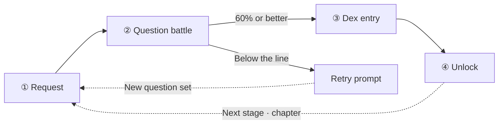
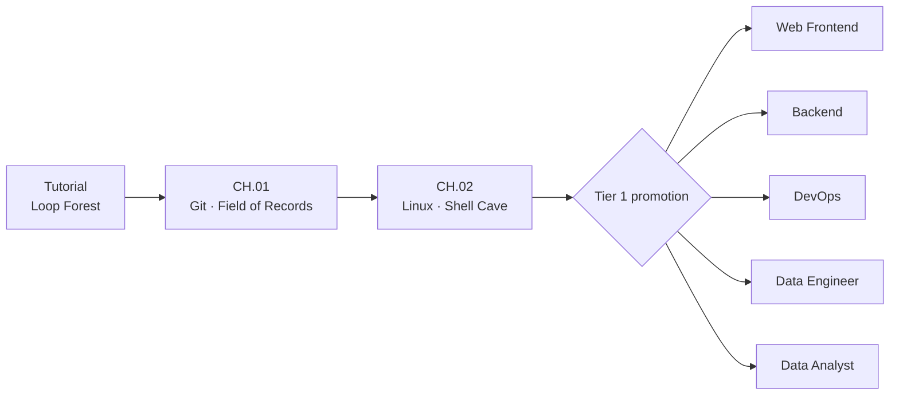

# Codigdex Game Design Document (v0.3)

[한국어](../kor/GAME_DESIGN.md) · **English**

> Pixel-art coding education game · Core mechanic: collecting coding concepts in a dex
> Last updated: 2026-09-15 · Stack: Next.js 16 + Phaser 4 → deployed on Vercel
> Original interactive design doc (v0.2, with diagrams): <https://claude.ai/code/artifact/75ffe799-5666-468f-80b8-94f5b00955ce>

This document is the primary source for the game design. The interactive doc is kept as a record of the v0.2 concept; all later changes go into this file only. Every section describes **the behavior that is implemented today**, and ideas that have not been built yet are collected in [10. Future work](#10-future-work).

The game supports Korean and English. English names in this document match the English UI, with the original Korean in parentheses where it helps.

> **Changes in v0.3**: a full pass to match the actual implementation.
>
> - The code-snippet assembly battle and the separate capture quiz were merged into **a single multiple-choice battle**. Answering a question is the attack.
> - Bronze, silver and gold grades were dropped in favor of a pass/fail rule: **capture at 60% correct or better**.
> - A chapter is now **five stages, Lv.1 to Lv.5**, instead of a single monster.
> - EXP, coins, the shop and rankings were not built and moved to future work.
> - The Git and Linux common path, tier 1–3 careers and the career dex were added after the tutorial.

## Contents

1. [Core concept](#1-core-concept)
2. [Game loop](#2-game-loop)
3. [World & tone](#3-world--tone)
4. [Screens](#4-screens)
5. [Example playthrough — Loop Forest tutorial](#5-example-playthrough--loop-forest-tutorial)
6. [Battle & capture rules](#6-battle--capture-rules)
7. [Dex system](#7-dex-system)
8. [Curriculum & progression](#8-curriculum--progression)
9. [Visual style guide](#9-visual-style-guide)
10. [Future work](#10-future-work)

## 1. Core concept

Codigdex does not stop at **reading** about coding concepts. A bug monster is registered (captured) in your personal dex, **Codigdex**, only after you prove you understand its concept by answering questions in battle. It is a pixel adventure where you fill in a dex of coding concepts one by one, just like a Pokédex.

The player starts as a junior developer in Codeville, a pixel village on a server cloud. After the tutorial and the Git and Linux common path, the player picks a career and grows the dex by visiting technology regions on that career's detail map.

### Design principles

1. **Understand it to collect it** — a monster card enters the dex only when the player answers enough battle questions correctly.
2. **One mistake is not a failure** — the player does not need a perfect score; 60% is enough to capture. Beginners should not be stopped by a single slip.
3. **Retry over punishment** — failing costs nothing. A retry draws a fresh set of questions from the pool.
4. **Progress is derived from the dex** — stage, chapter and career unlocks are recomputed from capture records instead of stored as separate flags.

## 2. Game loop

One cycle has four steps. After the unlock, the next stage or chapter opens and the loop returns to a new request.

| Step | What happens |
| --- | --- |
| ① Request | Tap the glowing quest marker or the guide NPC on the world map to meet the current stage's monster. The NPC's briefing and pre-battle line point out the concept |
| ② Question battle | Answer as many multiple-choice questions as the monster's level calls for; each correct answer hits the monster |
| ③ Dex entry | Clearing the capture line shows the result panel and registers the card in Codigdex |
| ④ Unlock | The next stage, the next chapter, or the end of the common path (career selection) opens |

## 3. World & tone

The setting is **Codeville**, a small server island floating above the clouds. The player is a "junior developer" who has just started coding, and fills in their own coding dex, Codigdex, by defeating the bug monsters that show up in each region.

- **Guide NPCs** — before promotion, bug researcher **Lupi (루피)** guides the tutorial and the common path. After promotion, a senior NPC with a name and title takes over for each career (UI Alchemist Mina, Server Guardian Taeo, and so on). Tier 2 and tier 3 careers have their own guides as well.
- **Tone** — the warm coziness of Stardew Valley + the collecting satisfaction of Pokémon + a retro Game Boy battle UI.
- **Humor** — the concept itself becomes the character: the Infinite Loop Bug keeps circling the same path, and the Branch Twins split a stem in two.

## 4. Screens

| Screen | Description | Key elements |
| --- | --- | --- |
| Title | Start or continue, and reset for a new game | `Continue` when a save exists, reset confirmation dialog, settings button |
| Settings | An overlay on top of the current screen | Language choice (한국어 · English); closing redraws the screen underneath in the chosen language |
| World map | The field player walks the stage route over the current chapter's region wallpaper | Route with Lv.1–Lv.4 around the edge and Lv.5 in the center, quest marker, first-visit onboarding, guide hints |
| Path map | Career roadmap from the tutorial → CH.01 → CH.02 → promotion | Chapter progress (`CH.01 · 2/5`, `CLEAR`), lock notices, change-career and dex buttons |
| Career lineage | Pick a career from four columns: pre-promotion → tier 1 → tier 2 → tier 3 | Locked/current badges, `???` slots, confirmation dialog showing the player character and guide NPC together |
| Career detail map | After promotion, explore technology regions on the career's wallpaper map | Hovered regions lift out as silhouettes, guide NPC and the player's field character, tier 2 `???` slot |
| Technology region | A zoomed-in view of the region picked on the detail map | Guide NPC portrait dialog, back to detail map / Path (battles connect once content ships) |
| Question battle | Attack the monster with multiple-choice questions on a Game Boy–style battle screen | NPC banner, monster HP bar, question index / correct count / target, 2×2 answer grid |
| Battle result | Settles capture success or failure and points to the next destination | New-entry flag, unlock notice, correct count vs. capture line, retry |
| Codigdex | Monster dex and career dex in tabs | Registered/released and undiscovered counts, numbered list, detail card, career emblems and lineage |

Every main screen has an icon Home button that returns to the title. The title, world map, Path map, career lineage and technology region screens also have a gear settings button beside it. Battle and result screens leave it out, because redrawing them would change the drawn questions.

### Language

The game supports Korean and English. A first visit follows the browser's language (falling back to Korean for unsupported languages), and the language picked in settings is stored in the save's `ui.locale`, surviving a new game. English names are translated from the Korean names (e.g. 깃새싹 → Git Sprout, 기록의 들판 → Field of Records).

- Interface copy lives in Korean and English catalogs in `web/lib/i18n/messages.ts`.
- Content such as monsters, quizzes, careers and regions is written as a `{ ko, en }` pair per field; a missing language fails type-checking.
- `web/test/i18n/i18n.test.ts` checks that both catalogs share keys and placeholders, that no translation is empty, and that no English string contains Hangul.

## 5. Example playthrough — Loop Forest tutorial

A walkthrough of the tutorial, which teaches the game loop with a `for` loop.

1. **Onboarding** — on the first visit Lupi says hello and explains the rule: answer at least 60% of the questions to register a monster in the dex.
2. **Request** — tapping the glowing quest marker by the well starts Lupi's briefing: "The Infinite Loop Bug keeps circling the well. Defeat it and register it in the dex!"
3. **Question battle** — the Infinite Loop Bug is Lv.1, so **3 questions** are drawn at random from its pool of 20. Answer order is shuffled every time.
   - e.g. How many times does `for i in range(5):` loop? → **5**
   - e.g. What is the first value `range(5)` produces? → **0**
   - The monster faints and the battle ends the moment 2 answers are correct. It also ends right away once 2 wrong answers make the target unreachable.
4. **Dex entry** — on success the `No.000 Infinite Loop Bug` card is registered. Card text: "for loop — syntax that repeats the same action a fixed number of times. range(5) means 5 times, from 0 to 4."
5. **Unlock** — a "Next chapter unlocked · CH.01 Git" notice opens the Field of Records. On failure, the result shows the correct count and the capture line, and the player returns to the world map to try again.

## 6. Battle & capture rules

The battle is the questions themselves; there is no separate quiz step. All rules live in `web/lib/domain/dex/`.

- **Question count**: monster level + 2. Lv.1 asks 3, Lv.5 asks 7.
- **Drawing**: every monster has a pool of 20 questions. Each battle draws a random subset and shuffles each question's choices, so a retry gets a different set.
- **Capture line**: 60% of the questions asked, rounded up.

| Level | Asked | Correct answers to capture |
| --- | ---: | ---: |
| Lv.1 | 3 | 2 |
| Lv.2 | 4 | 3 |
| Lv.3 | 5 | 3 |
| Lv.4 | 6 | 4 |
| Lv.5 | 7 | 5 |

- **Early finish**: the battle ends as soon as the target is reached, or as soon as answering every remaining question correctly could no longer reach it.
- **HP bar**: monster HP drops in proportion to the correct answers still needed, hitting exactly 0 when the target is reached.
- **Recapture**: beating a monster that is already registered leaves the card unchanged and keeps the original capture time.

## 7. Dex system

Codigdex has two tabs: the **monster dex** and the **career dex**.

### Monster dex

- **Card contents**: pixel illustration, dex number, name, classification, trait, concept description, example code snippet, first capture date.
- **Numbering**: `000` for the tutorial, `001–005` for CH.01 Git, `006–010` for CH.02 Linux.
- **Undiscovered slots**: specialist technologies without battles yet (HTML/CSS through BI tools) hold later numbers as `???` slots. The technology name and monster stay hidden.
- **Completion**: the header shows `registered n/released · undiscovered m`. Undiscovered slots do not count toward completion.

### Career dex

- Collects 16 career emblems, from junior to tier 3, numbered from `JOB.000`.
- Each career is locked, available, current, or MASTER, and records the first promotion date and the MASTER date.
- The detail view shows the guide NPC and the promotion requirement (e.g. `Web Frontend Developer + Backend Developer`).
- Unlock and MASTER records are never erased once earned.

## 8. Curriculum & progression

After learning the game loop in the tutorial, the player goes through the junior common path of Git and Linux and then promotes into a career.

| Step | Course | Contents | Status |
| --- | --- | --- | --- |
| Tutorial | Loop Forest (반복문의 숲) | 1 single-stage monster | Playable |
| CH.01 | Git · Field of Records (기록의 들판) | 5 monsters, Lv.1–Lv.5 | Playable |
| CH.02 | Linux · Shell Cave (셸 동굴) | 5 monsters, Lv.1–Lv.5 | Playable |
| Tier 1 promotion | 5 careers | A detail map per career, 28 technology regions | Maps and art done, battle content in progress |
| Tier 2 · 3 promotion | 5 hybrid and 5 master careers | Lineage, guides, emblems | `???` preview |

- **Sequential unlocks**: capturing a stage opens the next stage; capturing a chapter's last stage opens the next chapter.
- **Entering promotion**: the first capture of CH.02's last monster goes straight from the result screen to the career lineage screen. A save that finished the common path without picking a career is also sent to the promotion screen on its next visit.
- **Rewards**: today the rewards are dex cards, unlocking the next content, and MASTER records in the career dex.

Career roadmaps, promotion requirements, shared technologies and the save format follow the [Career Path Design](CAREER_PATH_DESIGN.md).

## 9. Visual style guide

The game runs at 960×540. Region wallpapers and battle arenas are painted at the same 960×540, monster and career character illustrations are 256×256, and the field player that walks the world map is a 96×128 sprite. The reference visual is `web/public/assets/wallpapers/codigdex-field-guide-wallpaper-v3.png` ("a junior developer holding a field guide, with bug monster regions"), using a limited warm cream/maroon palette. The battle screen contrasts with the field screens through Game Boy Color–style panels and a pixel font.

Each region layers an ambience effect: Loop Forest (`loop-forest`), Field of Records (`git-field`), Shell Cave (`linux-cave`), and the title archive (`title-archive`).

### In-game art palette

Defined in `web/lib/phaser/palette.ts`.

| Color | Token | HEX |
| --- | --- | --- |
| Ink (text/outlines) | `ink` | `#2A1D14` |
| Maroon red (quest/action accent) | `maroon` | `#A33422` |
| Amber orange (highlights/keywords) | `amber` | `#E8834F` |
| Wood brown (dex/secondary accent) | `wood` | `#6B4226` |
| Sand (borders) | `sand` | `#D6BD91` |
| Cream (background/paper) | `cream` | `#F1E4CB` |
| Muted brown (secondary text) | `mutedBrown` | `#7A6248` |
| Night brown (dark background) | `nightBrown` | `#180F08` |

## 10. Future work

### MVP done

- [x] World map and chapter stage routes (tutorial · Git · Linux)
- [x] Multiple-choice question battle with the 60% capture rule
- [x] 20-question pool per monster with random draws
- [x] Guide NPC onboarding, briefings and success/retry lines
- [x] Codigdex monster dex and career dex
- [x] Tier 1–3 career lineage and per-career detail maps
- [x] Local save v3 with automatic v1/v2 migration
- [x] Korean and English support with a settings screen

### Next

- [ ] Connect battle and question content for tier 1 specialist chapters (technology region → battle)
- [ ] Fill in each career path's completion requirement (`completionCaptureIds`) → real tier 2 unlocks
- [ ] Tier 2 integration chapters and mastery requirements (`masteryCaptureIds`) → tier 3 unlocks

### Parked ideas (carried over from v0.2)

- [ ] Card grades by accuracy (bronze · silver · gold), retry upgrades, chapter master badges
- [ ] Code-snippet assembly and debugging battle mini-game
- [ ] EXP, levels and character cosmetics
- [ ] Coins and a shop for dex covers and card frame skins
- [ ] Comparing dexes with other players · rankings
- [ ] Automatic question generation (evaluate LLM-authored questions)
- [ ] Mobile support
