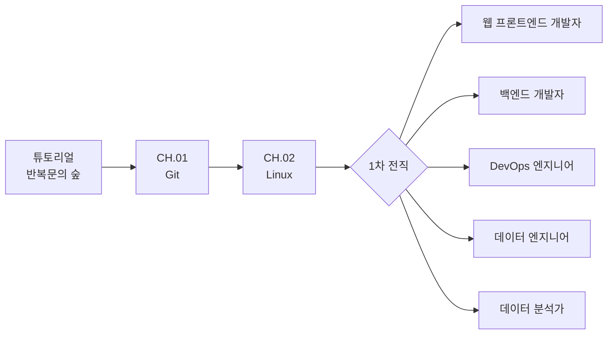
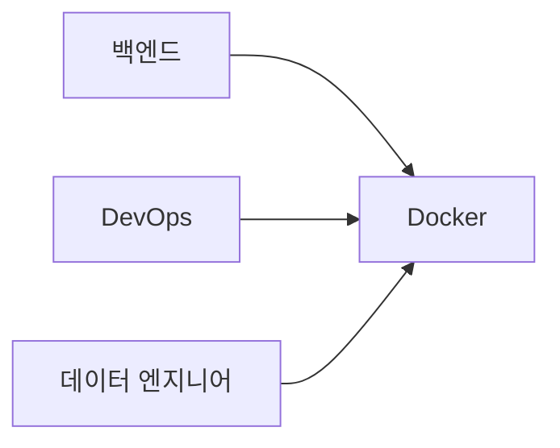

# Codigdex 직업 전직 Path 설계

**한국어** · [English](../eng/CAREER_PATH_DESIGN.md)

Codigdex의 학습 여정은 **튜토리얼 → 주니어 공통 과정 → 1차 전직 → 직업별 전문 과정 → 2차·3차 전직** 순서로 진행한다. 이 문서는 게임 콘텐츠를 확장할 때의 기준이자, 개발자 교육 로드맵을 소개하는 블로그 글의 기초 자료로 사용한다.

> 최종 갱신: 2026-09-15. 각 절은 현재 구현을 기준으로 쓰고, 아직 콘텐츠가 없는 부분은 **(예정)** 으로 표시한다. 게임 전반의 규칙은 [게임 기획서](GAME_DESIGN.md)를 따른다.

## 전체 구조



튜토리얼은 정규 챕터가 아니다. 반복문 문제를 통해 의뢰, 문제 배틀, 도감 등록이라는 게임의 핵심 루프를 먼저 경험하게 한다. 정규 커리큘럼의 시작은 `CH.01 Git`이다.

## 주니어 공통 과정

| 순서 | 과정 | 지역 | 공통으로 배우는 이유 |
| --- | --- | --- | --- |
| CH.01 | Git | 기록의 들판 | 변경 이력 관리, 협업, 복구는 모든 개발 직군의 기본 역량이다. |
| CH.02 | Linux | 셸 동굴 | 파일, 경로, 권한, 프로세스, 명령 실행을 이해해야 이후 개발 도구를 스스로 다룰 수 있다. |
| 전직 | 1차 직업 선택 | 전직 계보 화면 | 최소 공통 기반을 갖춘 뒤 관심 직무의 전문 과정으로 진입한다. |

공통 과정은 짧게 유지한다. 모든 기술을 전직 조건으로 만들면 플레이어가 관심 직무를 만나기 전에 지칠 수 있기 때문이다.

### 챕터 안의 단계

공통 과정의 각 챕터는 몬스터 한 마리가 아니라 **Lv.1~Lv.5 다섯 단계**로 이뤄진다. 월드맵에서는 Lv.1~Lv.4가 지역을 한 바퀴 두르고, 마지막 Lv.5가 중앙의 마스터 조우로 배치된다. 한 단계를 포획하고 돌아오면 필드 플레이어가 지형을 따라 그린 경로를 걸어 다음 단계 거점으로 이동한다.

- 앞 단계를 포획해야 다음 단계가 열리고, 마지막 단계를 포획하면 다음 챕터가 열린다.
- 단계마다 도감 한 칸과 주제별 문제 20개가 있다.
- 한 번의 배틀에서 뽑는 문제 수는 레벨 + 2다(Lv.1 3문제 → Lv.5 7문제).
- 뽑힌 문제 중 60% 이상(소수점 올림)을 맞히면 포획된다(Lv.1 2/3 · Lv.2 3/4 · Lv.3 3/5 · Lv.4 4/6 · Lv.5 5/7).
- 목표 정답 수에 도달하거나 목표 달성이 불가능해지는 즉시 배틀이 끝난다.

모든 문제를 맞혀야 하는 방식은 입문자에게 한 번의 실수가 곧 실패가 되어 지나치게 어렵기 때문에 쓰지 않는다.

| 챕터 | Lv.1 | Lv.2 | Lv.3 | Lv.4 | Lv.5 |
| --- | --- | --- | --- | --- | --- |
| CH.01 Git (`001~005`) | 깃새싹 · 저장소 기초 | 브랜치 쌍둥이 · branch와 merge | 충돌 되돌이 · 충돌과 되돌리기 | 원격 리베이서 · 원격과 rebase | 워크플로 수호자 · PR·리뷰·CI |
| CH.02 Linux (`006~010`) | 셸 탐험가 · 셸 기초 | 경로 채집가 · 경로와 파일 | 권한 수호병 · 권한과 사용자 | 파이프 엔지니어 · 파이프와 프로세스 | 커널 수호자 · 커널과 부팅 |

챕터 표본(`git-specimen`, `linux-specimen`)은 Path 맵에서 챕터를 대표하는 아이콘으로 쓰고, 배틀에는 단계별 몬스터가 등장한다.

### 1차 전직 진입

CH.02 Lv.5를 처음 포획하면 결과 패널에 "공통 과정 완료!" 알림이 뜨고, 확인을 누르면 월드맵 대신 전직 계보 화면으로 이동한다. 공통 과정을 끝냈지만 아직 직업을 고르지 않은 저장 데이터도 다음 진입 때 전직 화면으로 복구한다. 전직을 확정하기 전에는 플레이어 직업 캐릭터와 안내 NPC를 나란히 보여 주는 확인 창을 띄운다.

## Docker를 공통 필수에서 제외하는 이유

Docker는 중요한 기술이지만 모든 입문 직군이 같은 시점과 깊이로 배워야 하는 기초는 아니다. 컨테이너는 터미널, 프로세스, 네트워크, 서버 실행에 대한 이해가 있을 때 학습 효과가 높다.

따라서 Docker는 전직 이후 여러 직업이 다시 만나는 **공유 전문 기술 지역**으로 설계한다.



프론트엔드 개발자와 데이터 분석가도 필요에 따라 Docker를 선택 학습할 수 있지만, 전직을 막는 필수 조건으로 사용하지 않는다.

## 직업별 상세 지도

전직 후에는 직업별 v3 월페이퍼 상세 지도에 기술 지역이 순서대로 배치된다. 아래 순서가 곧 권장 진행 순서다.

| 직업 | 안내 NPC | 기술 지역 (지도 순서) | 수 |
| --- | --- | --- | ---: |
| 웹 프론트엔드 개발자 | UI 연금술사 미나 | HTML/CSS → JavaScript → 브라우저·HTTP → React → 프론트엔드 테스트 | 5 |
| 백엔드 개발자 | 서버 수호자 태오 | HTTP/API → 서버 프레임워크 → 데이터베이스·SQL → 인증·보안 → 네트워크 → Docker | 6 |
| DevOps 엔지니어 | 자동화 장인 도윤 | 네트워크 → Docker → CI/CD → Kubernetes → Cloud·IaC → 모니터링 | 6 |
| 데이터 엔지니어 | 파이프라인 설계자 하나 | Python → SQL·데이터 모델링 → 데이터 파이프라인 → Docker → 오케스트레이션 → 모니터링 | 6 |
| 데이터 분석가 | 인사이트 탐정 이안 | SQL → 기초 통계 → 데이터 시각화 → BI 도구 → 분석용 Python | 5 |

지역 정의는 `web/lib/phaser/worldMap/careerPaths.ts`에 있다. 현재 기술 지역 28곳은 모두 플레이할 수 있으며, 각 지역은 순서가 있는 몬스터 5종과 몬스터별 한·영 20문항 풀을 제공한다.

### 맵의 깊이와 이동

Path 화면과 플레이 지역은 같은 화면이 아니다. Path 맵은 공통 과정과 전직 관계를 보여 주는 진로도이고, 1차 직업을 선택하면 월드맵이 해당 직업의 **상세 지도**로 바뀐다. 상세 지도에서 열린 기술 지역을 누르면 그 지역을 확대한 **기술 지역 화면**으로 들어가며, 몬스터 체크포인트 5곳이 기존 배틀·포획 흐름으로 이어진다.

```text
Path 맵 → 직업별 상세 지도 → 기술 지역 → 배틀/포획
```

직업별 월페이퍼에는 이동 경로와 거점이 그려져 있고, 게임 UI는 번호 원판 대신 각 건물·섬의 실제 경계에 맞춘 보이지 않는 클릭 영역과 `순서 · 기술명` 라벨을 표시한다. 해당 구역에 마우스를 올리면 월페이퍼에서 구역 경계대로 잘라 만든 투명 텍스처(`<직업>-<지역>-terrain-v3.png`)만 위로 띄우고 아래에 그림자를 더하며, 지도 중앙에 지역 이름을 보여 준다. 클릭 영역(`focusPoints`)은 넉넉하게, 떠오르는 실루엣(`lift`)은 건물 윤곽에 딱 맞게 따로 정의한다. 사각형이나 다각형 윤곽을 직접 그리지 않으며 원본 월페이퍼 전체는 움직이지 않는다. 지도 하단에는 안내 NPC, 현재 직업의 필드 캐릭터(`MY PLAYER`), 2차 전직 `◆ ???` 슬롯이 함께 놓인다.

따라서 새 챕터를 추가할 때는 Path 맵을 다시 그리는 대신 상세 지도 데이터에 목적지의 포커스 영역을 추가하고, 그 목적지를 챕터 지역과 연결한다.

### 캐릭터와 안내 NPC

전직 전 공통 과정은 버그 연구원 루피가 안내한다. 전직 후 상세 지도에서는 직업별 선배 NPC가 안내를 이어받고, 대화창 하단에 상반신 초상화로 등장한다. 직업을 바꾸면 저장된 1차 직업과 함께 지도·NPC가 즉시 교체된다.

| 자산 | 경로 | 용도 |
| --- | --- | --- |
| 직업 전신 캐릭터 | `assets/characters/career-path/<직업-id>/player-v2.png` | 전직 계보 목록, 전직 확정 창 |
| 안내 NPC | `assets/characters/career-path/<직업-id>/guide-v1.png` | 대화창 초상화 |
| 필드 플레이어 (주니어) | `assets/characters/player/overworld-player-v1.png` | 공통 과정 챕터 경로 이동 |
| 필드 플레이어 (1차 직업) | `assets/characters/career-path/<직업-id>/overworld-v1.png` | 전직 후 월드맵 이동, 상세 지도 `MY PLAYER` |
| 캐릭터 비교표 | `assets/characters/career-path/career-character-guide-v2.png` | 주니어~3차 직업 플레이어·가이드 아카이브 |
| 직업 심볼 | `assets/career-emblems/<직업-id>-v1.png` | 직업 도감 (16종) |

## 직업 사이의 공유 기술

직업 Path는 완전히 분리된 다섯 개의 선이 아니다. 같은 기술을 서로 다른 맥락에서 만나는 교차형 트리다. 아래 표는 현재 상세 지도에 실제로 배치된 공유 지역이다.

| 공유 기술 | 지도에 배치된 직업 |
| --- | --- |
| HTTP · API | 웹 프론트엔드, 백엔드 |
| SQL · 데이터베이스 | 백엔드, 데이터 엔지니어, 데이터 분석가 |
| Python | 데이터 엔지니어, 데이터 분석가 |
| Docker | 백엔드, DevOps, 데이터 엔지니어 |
| 네트워크 | 백엔드, DevOps |
| 모니터링 | DevOps, 데이터 엔지니어 |

기술 개체 정의(`packages/game-content/src/domain/technologySpecimens.ts`)의 `paths`는 이보다 넓은 연결을 기록한다. 예를 들어 테스트·CI/CD는 프론트엔드·백엔드·DevOps, Cloud·IaC·Kubernetes는 백엔드·DevOps·데이터 엔지니어와 연결되어 있다. 지도에 지역을 추가할 때 이 목록을 기준으로 삼는다.

포획 기록은 직업과 무관하게 하나의 도감에 쌓이므로, 공유 기술을 먼저 포획한 플레이어가 다른 직업으로 전직해도 해당 카드는 그대로 유지된다. 재학습을 강요하지 않으면서 다른 직무를 탐색할 동기가 생긴다.

## 1차 직업 변경 규칙

- 주니어 상태에서는 5개 1차 직업 중 어느 것이든 고를 수 있다.
- 한 번 1차 직업을 선택하면 해당 직업 경로를 완료(MASTER)하기 전에는 다른 1차 직업으로 바꿀 수 없다. 전직 계보에서 다른 직업은 `잠금`으로 표시되고, 누르면 "현재 직업의 모든 챕터를 완료하면 다른 1차 전직을 선택할 수 있어요" 안내가 뜬다.
- 경로 완료 여부는 각 직업의 최종 포획 목록(`completionCaptureIds`)이 모두 도감에 있는지로 계산한다. 목록이 비어 있는 경로는 완료로 간주하지 않는다.
- 각 1차 직업의 `completionCaptureIds`는 출시된 지역에서 자동으로 계산한다. 모든 체크포인트를 완료하면 해당 직업이 MASTER로 기록되고 다른 1차 경로를 선택할 수 있다.

## 2차 전직 (하이브리드 직업)

1차 직업 경로 두 개를 완료하면 두 분야를 잇는 2차 직업이 열린다. 공유 카드를 유지하는 규칙과 이어져, 한 직업을 끝낸 플레이어가 다른 직업을 탐색할 동기가 된다. 통합 챕터 콘텐츠는 필요한 1차 경로가 완성된 뒤 구성한다 **(예정)**.

전직 계보 화면은 왼쪽부터 **전직 전 주니어 개발자 → 1차 직업 → 2차 직업 → 3차 직업**의 네 열로 표시한다. 주니어 카드에서 모든 1차 직업으로 선이 갈라지고, 각 1차 직업은 조합 가능한 2차 직업으로 이어진다. MASTER 기록이 있는 1차 직업 집합과 각 2차 직업의 `requires` 조합을 비교해 두 경로가 모두 끝난 경우에만 이름과 선택 기능을 공개한다. 예를 들어 프론트엔드와 백엔드를 모두 완료하면 풀스택 엔지니어가 열리지만, DevOps까지 완료하지 않았다면 플랫폼 엔지니어/SRE는 계속 잠긴다. 각 2차 직업은 대응하는 3차 직업 하나와 수평으로 연결해 전체 계보에서도 관계가 엉키지 않게 한다.

| 2차 직업 | 안내 NPC | 해금 조건 | 통합 챕터에서 다룰 흐름 (예시) |
| --- | --- | --- | --- |
| 풀스택 엔지니어 | 경계의 설계자 아라 | 웹 프론트엔드 + 백엔드 | 화면과 API 연결, 인증, 배포 |
| 플랫폼 엔지니어 / SRE | 플랫폼 항해사 준 | 백엔드 + DevOps | 서비스 배포 파이프라인, 관찰 가능성, 장애 대응 |
| ML Developer | 모델 조련사 유진 | 백엔드 + 데이터 엔지니어 | 모델 서빙, 추론 API, 데이터·모델 파이프라인 |
| MLOps 엔지니어 | 모델 운영관 시우 | DevOps + 데이터 엔지니어 | 파이프라인 컨테이너화, 스케줄링, 모니터링 |
| 분석 엔지니어 | 지표 번역가 소라 | 데이터 엔지니어 + 데이터 분석가 | 데이터 모델링, 변환, 지표 정의 |

- **조합은 실제 직무명이 있는 것만 둔다.** 1차 직업 5개의 모든 조합(10가지)을 만들면 콘텐츠만 늘고 직업의 의미가 흐려진다.
- **도감식 실루엣으로 공개한다.** 전직 계보와 상세 지도에 `◆ ???` 슬롯으로 존재만 보여 준다. 상세 지도의 슬롯은 "다른 1차 직업 경로까지 완성하면 정체가 드러나요"라고만 알리고, 전직 계보·Path 맵의 슬롯은 "`<직업 A> + <직업 B>` 경로를 모두 완료하면 열려요"처럼 해금 조건을 알려 준다. 완전히 숨기면 존재를 몰라 동기가 생기지 않는다.
- **미래 몬스터도 도감에 자리를 잡는다.** 아직 배틀이 없는 전문 기술 몬스터는 번호와 `???`만 표시한다. 미발견 슬롯은 도감의 등록 수·완성도 계산에서 제외한다.
- **칭호만 주지 않는다.** 두 분야를 잇는 5단계 통합 챕터, 전용 가이드 NPC, 직업 심볼을 함께 제공한다.
- **해금은 기록에서 다시 계산한다.** 1차 경로 완료는 포획 기록으로 검증한 뒤 직업 도감에 MASTER 이력으로 남기고, 2차·3차 해금은 이 이력을 기준으로 계산한다. 선택한 2차 직업이 바뀌면 선택한 3차 직업은 초기화한다.

직업 제작 순서(DevOps → 백엔드 → 데이터 엔지니어 → 웹 프론트엔드 → 데이터 분석가)를 따르면 플랫폼 엔지니어가 가장 먼저(백엔드 경로 완성 시) 열리고, 풀스택 엔지니어는 웹 프론트엔드 경로가 완성된 뒤 열린다.

## 3차 전직 (마스터 직업)

3차 전직은 또 다른 직업 조합을 요구하지 않고, 선택한 2차 직업의 마스터 경로와 최종 프로젝트를 완료하면 열린다. 전직 계보 화면은 각 2차 직업 옆에 대응하는 3차 직업 하나만 이어 붙여 연결선이 다시 복잡해지지 않게 한다.

아직 마스터 챕터가 출시되지 않은 2차 직업은 완료 조건(`masteryCaptureIds`)을 빈 배열로 유지한다. 이 상태는 2차 경로를 완료한 것으로 간주하지 않으며, 3차 카드는 `???` 미리보기로 남는다. 잠긴 3차 카드를 누르면 "`<2차 직업>` 마스터 경로를 완료하면 열려요" 안내가 뜬다.

| 2차 직업 | 3차 직업 | 안내 NPC |
| --- | --- | --- |
| 풀스택 엔지니어 | 소프트웨어 아키텍트 | 시스템 대현자 로한 |
| 플랫폼 엔지니어 / SRE | 클라우드 플랫폼 아키텍트 | 구름 성채 설계자 하늘 |
| ML Developer | AI 프로덕트 엔지니어 | AI 공방장 지안 |
| MLOps 엔지니어 | AI 플랫폼 아키텍트 | 지능 기반 설계자 레온 |
| 분석 엔지니어 | 데이터 아키텍트 | 데이터 기록관 서윤 |

## 직업 도감

Codigdex의 `직업` 탭은 주니어부터 3차 직업까지 16종을 `JOB.000`부터 번호순으로 수집한다. 각 기록은 다음 시각을 가진다.

| 필드 | 기록 시점 |
| --- | --- |
| `unlockedAt` | 직업이 해금된 때. 주니어는 처음부터, 1차 직업은 공통 과정 완료 시, 2차는 두 1차 직업 MASTER 시, 3차는 대응 2차 직업 MASTER 시 |
| `selectedAt` | 그 직업으로 처음 전직한 때 |
| `masteredAt` | 그 직업의 경로를 완료한 때. 주니어는 공통 과정 완료 시 |

화면에는 잠금 · 전직 가능 · 현재 직업 · MASTER 상태와 `등록 n/16 · MASTER m` 통계를 표시한다. 한 번 기록된 시각은 다시 지우지 않으므로, 직업을 바꿔도 이전 직업의 최초 전직·MASTER 이력이 남는다.

## 저장 구조

브라우저 저장은 `localStorage`의 `codigdex:save:v3` 한 슬롯에 두며, 변경이 잦은 화면 상태를 한 객체에 평평하게 쌓지 않고 `progress`, `player`, `ui`로 나눈다. 플랫폼 중립 스키마와 마이그레이션은 `packages/game-core/src/save/schema.ts`에 있다.

```ts
{
  version: 3,
  progress: {
    captures: [{ id, capturedAt }],                            // 몬스터 포획 기록
    careers: [{ id, unlockedAt, selectedAt?, masteredAt? }],   // 직업 도감 이력
  },
  player: { primaryJobId, secondaryJobId, tertiaryJobId },    // 현재 선택한 직업
  ui: { tutorialOnboardingSeen, locale? },                     // 진행과 무관한 화면 상태·언어
}
```

- `progress.captures`에는 몬스터 ID와 포획 시각만 저장한다. 카드 표시 정보는 현재 카탈로그 정의에서 다시 구성한다.
- `progress.careers`에는 직업별 해금·최초 선택·MASTER 시각을 저장한다. Path 맵, 전직 계보, 도감을 열 때 현재 포획 기록과 선택 직업으로 새로 달성한 이력을 덧붙이되 기존 이력은 지우지 않는다.
- `player`에는 현재 선택한 1차·2차·3차 직업을 저장한다. 1차 직업의 기본값은 `junior`다.
- `ui.locale`에는 설정에서 고른 언어(`ko`·`en`)를 저장한다. 새 게임 초기화 후에도 유지하며, 없으면 브라우저 언어로 시작한다.
- 이전 `codigdex:save:v1`(평평한 구조)과 `codigdex:save:v2`(`careers` 없음)는 첫 로드 때 v3로 변환한다. 이때 선택된 직업을 기준으로 직업 도감 이력을 복원한다. 구버전 슬롯은 마이그레이션 안전망으로 남겨 두고, 새 게임 초기화 시 세 슬롯을 함께 정리한다.

## 기술 개체 디자인 기준

현재 상세 지도 구역과 준비된 대표 기술 개체를 대조한 결과다. 공유 기술 개체가 다른 지도에 존재하더라도 구역 주제와 일치하지 않으면 준비 완료로 세지 않는다.

| 1차 직업 | 현재 기술 구역 | 일치하는 대표 개체 | 추가 필요 |
| --- | ---: | ---: | --- |
| 웹 프론트엔드 개발자 | 5 | 5 | 없음 |
| 백엔드 개발자 | 6 | 6 | 없음 |
| DevOps 엔지니어 | 6 | 6 | 없음 |
| 데이터 엔지니어 | 6 | 6 | 없음 |
| 데이터 분석가 | 5 | 5 | 없음 |

현재 기술 구역 28개는 모두 일치하는 대표 개체를 갖는다. 기술 개체는 22종(공통 2 + 전문 20)이며, `web/public/assets/monsters/ch01.git/`부터 `ch22.bi-tools/`까지 챕터 폴더마다 표본(specimen)과 Lv.1~Lv.5 진화 세트, 진화 시트를 둔다. 전체 준비 현황은 `web/public/assets/monsters/all-monster-evolution-guide-v1.png`에서 한눈에 확인할 수 있다. 튜토리얼의 루프 버그(`ch00.tutorial`)는 진화하지 않는 단일 단계 개체이므로 나머지 칸을 `N/A`로 표시한다. 폴더별 표본과 진화 세트가 모두 있는지는 `web/test/domain/assets.test.ts`가 검사한다.

기술 이름을 로고처럼 붙이는 대신, 기술의 대표 개념을 도감에서 기억할 수 있는 생물 실루엣으로 바꾼다. 기존 블로그의 Git 개체를 시각적 기준점으로 삼아 굵은 어두운 외곽선, 따뜻한 크림색, Git 오렌지 포인트, 작은 흰색 눈을 공통 문법으로 사용한다.

| 폴더 | 기술 | 캐릭터 원형 | 기억할 개념 |
| --- | --- | --- | --- |
| ch01 | Git | 가지와 노드가 자라는 주황색 생물 | 브랜치, 커밋, 병합 |
| ch02 | Linux | 명령 패널을 단 펭귄 탐험가 | 셸, 명령 실행, 운영체제 |
| ch03 | HTML/CSS | 벽돌과 색상 판을 조립하는 아르마딜로 | 구조, 스타일, 레이아웃 |
| ch04 | JavaScript | 코드 꼬리에 전류가 흐르는 반딧불 여우 | 동작, 이벤트, 상태 변화 |
| ch05 | HTTP/API | 요청 편지를 주고받는 두 머리 전령새 | 요청, 응답, 인터페이스 |
| ch06 | Python | 두루마리를 연구하는 뱀 학자 | 자동화, 데이터 처리, 범용 문법 |
| ch07 | SQL | 테이블 서랍을 멘 기록관 두더지 | 조회, 관계, 데이터 정리 |
| ch08 | 네트워크 | 세 개의 신호 노드를 연결하는 케이블 게 | 연결, 주소, 패킷 |
| ch09 | 테스트 | 버그의 흔적을 찾는 탐정 딱정벌레 | 검증, 회귀 방지, 신뢰성 |
| ch10 | 보안 · 인증 | 열쇠 꼬리와 겹갑옷을 가진 천산갑 수호자 | 신원, 권한, 보호 |
| ch11 | Docker | 컨테이너 세 개를 운반하는 고래 | 이미지, 컨테이너, 격리 |
| ch12 | CI/CD | 상태등과 순환 팔을 가진 릴레이 러너 | 자동화, 파이프라인, 피드백 |
| ch13 | Kubernetes | 세 개의 Pod를 지휘하는 클러스터 조타수 | 배치, 조율, 복구 |
| ch14 | Cloud · IaC | 설계도로 인프라 블록을 배치하는 구름 골렘 | 선언, 자동 구성, 확장 |
| ch15 | 모니터링 | 망원경 눈과 상태 깃털을 가진 관측 올빼미 | 상태, 지표, 이상 감지 |
| ch16 | React | 여섯 갈래 노드 팔을 뻗은 컴포넌트 창 로봇 | 컴포넌트, props, 상태·훅 |
| ch17 | 서버 프레임워크 | 라우팅 방패를 든 붉은 딱정벌레 | 라우트, 미들웨어, 컨트롤러 |
| ch18 | 데이터 파이프라인 | 물방울을 품에 안고 나르는 수달 | 수집, 변환, 흐름 |
| ch19 | 워크플로 오케스트레이션 | 신호 구슬 더듬이를 단 보라색 거미 | 태스크, 의존성, 재시도·스케줄 |
| ch20 | 기초 통계 | 주사위를 곁에 둔 붉은 올빼미 | 표본, 확률, 분포·추론 |
| ch21 | 데이터 시각화 | 막대 그래프를 꼬리에 단 카멜레온 | 차트, 플롯, 대시보드 |
| ch22 | BI 도구 | 막대 차트 보드를 든 벌 | 지표, 리포트, KPI·의사결정 |

Linux 펭귄과 Docker 고래처럼 널리 알려진 상징은 학습자가 기술을 즉시 알아보는 출발점으로만 사용한다. 공식 마스코트나 로고를 그대로 복제하지 않고, 장비·자세·색상과 게임 세계관을 더해 Codigdex 고유 개체로 발전시킨다.

## 블로그용 핵심 요약

> 처음에는 Git과 Docker를 모든 직업의 공통 과정으로 묶었다. 하지만 Docker는 터미널, 프로세스, 네트워크 같은 선행 지식이 있어야 제대로 이해할 수 있고 직업마다 필요한 시점도 달랐다. 그래서 공통 과정은 Git과 Linux로 최소화하고, Docker는 백엔드·DevOps·데이터 엔지니어가 전직 후 다시 만나는 공유 전문 기술로 옮겼다. 이 구조는 입문자의 초기 부담을 줄이면서 직업 간 기술의 연결 관계도 보여준다.
