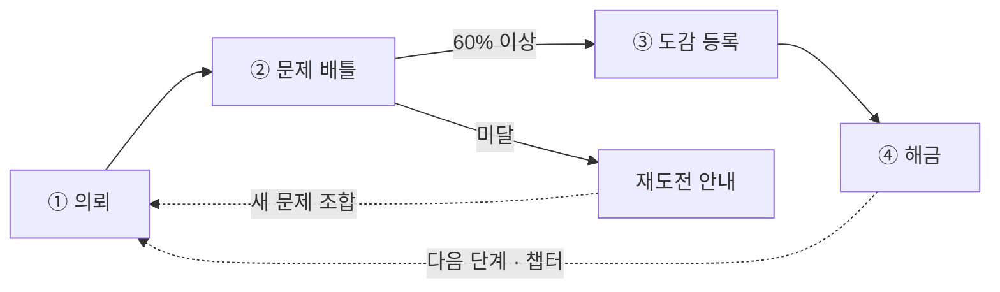
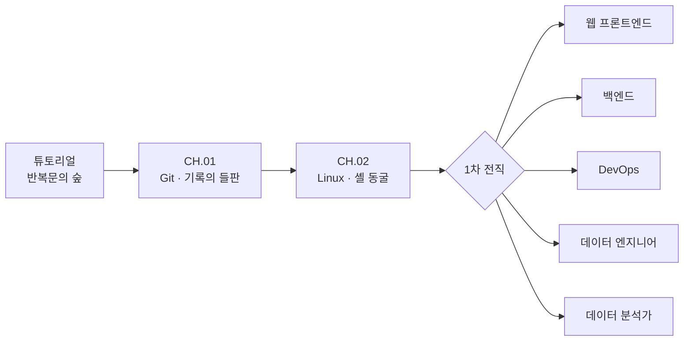

# Codigdex 게임 기획서 (v0.3)

**한국어** · [English](../eng/GAME_DESIGN.md)

> 픽셀 아트 코딩 교육 게임 · 핵심 메커니즘: 코딩 개념 수집(도감)
> 최종 갱신: 2026-09-15 · 기술 스택: Next.js 16 + Phaser 4 → Vercel 배포
> 초기 인터랙티브 기획서(v0.2, 다이어그램 포함): <https://claude.ai/code/artifact/75ffe799-5666-468f-80b8-94f5b00955ce>

이 문서는 게임 기획의 1차 소스다. 인터랙티브 기획서는 v0.2 시점의 구상으로 남겨 두고, 이후 변경은 이 파일에만 반영한다. 각 절은 **현재 구현된 동작**을 기준으로 쓰고, 아직 만들지 않은 구상은 [10. 향후 확장](#10-향후-확장)에 모은다.

> **v0.3 변경 사항**: 실제 구현에 맞춰 전면 정리했다.
>
> - 코드 조각 조립 배틀과 별도의 캡처 퀴즈 단계를 **4지선다 문제 배틀 하나**로 합쳤다. 문제에 답하는 것이 곧 공격이다.
> - 브론즈·실버·골드 등급을 없애고 **정답률 60% 이상이면 포획**하는 통과 방식으로 바꿨다.
> - 챕터를 몬스터 한 마리가 아니라 **Lv.1~Lv.5 다섯 단계**로 구성했다.
> - EXP·코인·상점·랭킹은 구현하지 않았으며 향후 확장 후보로 옮겼다.
> - 튜토리얼 뒤 Git·Linux 공통 과정과 1·2·3차 전직, 직업 도감을 추가했다.

## 목차

1. [핵심 컨셉](#1-핵심-컨셉)
2. [게임 루프](#2-게임-루프)
3. [세계관 & 톤](#3-세계관--톤)
4. [화면 구성](#4-화면-구성)
5. [예시 플레이스루 — 튜토리얼 반복문의 숲](#5-예시-플레이스루--튜토리얼-반복문의-숲)
6. [배틀 & 포획 규칙](#6-배틀--포획-규칙)
7. [도감 시스템](#7-도감-시스템)
8. [커리큘럼 & 진행](#8-커리큘럼--진행)
9. [비주얼 스타일 가이드](#9-비주얼-스타일-가이드)
10. [향후 확장](#10-향후-확장)

## 1. 핵심 컨셉

Codigdex는 코딩 개념을 **읽는 것**에서 끝내지 않는다. 버그 몬스터와의 배틀에서 개념 문제를 풀어 이해했음을 증명해야 그 몬스터가 나만의 도감 **Codigdex**에 등록(포획)된다. 포켓몬 도감처럼 코딩 개념을 하나씩 수집해 채워 나가는 픽셀 어드벤처다.

플레이어는 서버 구름 위 픽셀 마을 코드빌(Codeville)의 주니어 개발자로 시작한다. 튜토리얼과 Git·Linux 공통 과정을 마친 뒤 원하는 직업으로 전직하고, 직업별 상세 지도에서 기술 지역을 돌며 도감을 넓힌다.

### 핵심 디자인 원칙

1. **이해해야 수집된다** — 몬스터 카드는 배틀 문제를 기준 이상 맞혀야만 도감에 등록된다.
2. **실수 한 번이 실패가 되지 않는다** — 모든 문제를 맞힐 필요 없이 60% 이상이면 포획된다. 입문자가 한 문제 실수로 좌절하지 않게 한다.
3. **처벌보다 재도전** — 실패해도 잃는 것이 없다. 다시 도전하면 문제 풀에서 새 문제 조합이 나온다.
4. **진행은 도감에서 계산한다** — 단계·챕터·직업 해금은 별도 플래그 대신 포획 기록에서 다시 계산한다.

## 2. 게임 루프

한 사이클은 4단계로 돈다. 보상 & 해금 이후 다음 단계나 다음 챕터가 열리고, 다시 의뢰로 돌아간다.

| 단계 | 내용 |
| --- | --- |
| ① 의뢰 | 월드맵의 빛나는 의뢰 표식이나 안내 NPC를 눌러 현재 단계 몬스터와 조우. NPC가 브리핑과 배틀 전 대사로 개념을 짚어 준다 |
| ② 문제 배틀 | 몬스터 레벨에 맞는 수의 4지선다 문제를 풀고, 정답마다 몬스터에 타격 |
| ③ 도감 등록 | 포획 기준을 넘기면 결과 패널과 함께 카드가 Codigdex에 등록 |
| ④ 해금 | 다음 단계, 다음 챕터, 또는 공통 과정 완료(전직 선택)가 열림 |

## 3. 세계관 & 톤

배경은 구름 위에 떠 있는 작은 서버 섬 **코드빌(Codeville)**. 플레이어는 이제 막 개발을 시작한 "주니어 개발자"로, 지역마다 출몰하는 버그 몬스터를 물리치며 자신만의 코딩 도감 Codigdex를 채워 나간다.

- **안내 NPC** — 전직 전에는 버그 연구원 **루피**가 튜토리얼과 공통 과정을 안내한다. 전직 후에는 직업마다 이름과 칭호를 가진 선배 NPC(UI 연금술사 미나, 서버 수호자 태오 등)가 안내를 이어받는다. 2·3차 직업에도 전용 가이드가 정해져 있다.
- **톤앤매너** — 스타듀밸리류의 따뜻한 코지함 + 포켓몬류의 수집 성취감 + 레트로 게임보이 배틀 UI.
- **유머 장치** — 무한루프 버그는 같은 경로를 계속 맴돌고, 브랜치 쌍둥이는 줄기를 둘로 찢어 놓는 식으로 개념 자체를 캐릭터 설정으로 쓴다.

## 4. 화면 구성

| 화면 | 설명 | 핵심 요소 |
| --- | --- | --- |
| 타이틀 | 시작·이어하기와 새 게임 초기화 | 저장 데이터가 있으면 `이어하기`, 초기화 확인 창, 설정 버튼 |
| 설정 | 현재 화면 위에 뜨는 오버레이 | 언어 선택(한국어·English), 닫으면 아래 화면을 선택한 언어로 다시 그림 |
| 월드맵 | 현재 챕터의 지역 월페이퍼 위에서 필드 플레이어가 단계 경로를 따라 이동 | Lv.1~Lv.4가 둘러싸고 중앙에 Lv.5가 있는 경로, 의뢰 표식, 첫 방문 온보딩, 안내 힌트 |
| Path 맵 | 튜토리얼 → CH.01 → CH.02 → 전직으로 이어지는 진로도 | 챕터 진행도(`CH.01 · 2/5`, `CLEAR`), 잠금 안내, 직업 변경·도감 버튼 |
| 전직 계보 | 전직 전 → 1차 → 2차 → 3차의 네 열 계보에서 직업 선택 | 잠금·현재 표시, `???` 슬롯, 플레이어 캐릭터와 가이드 NPC가 함께 나오는 확정 창 |
| 직업 상세 지도 | 전직 후 직업별 월페이퍼 지도에서 기술 지역 탐색 | 지역 호버 시 실루엣이 떠오르는 포커스 효과, 안내 NPC와 내 필드 캐릭터, 2차 전직 `???` 표시 |
| 기술 지역 | 상세 지도에서 고른 지역을 확대해 보여 주는 수집지 | 가이드 NPC 초상화 대화창, 상세 지도·Path 복귀 (배틀은 콘텐츠 출시 후 연결) |
| 문제 배틀 | 게임보이풍 배틀 화면에서 4지선다 문제로 몬스터 공격 | NPC 배너, 몬스터 체력 바, 문항 진행·정답 수·목표 수, 2×2 선택지 |
| 배틀 결과 | 포획 성공·실패를 확정하고 다음 행선지를 안내 | 신규 등록 여부, 해금 알림, 정답 수와 포획 기준, 재도전 |
| Codigdex (도감) | 몬스터 도감과 직업 도감을 탭으로 확인 | 등록 수/출시 수·미발견 수, 번호순 목록, 상세 카드, 직업 심볼과 전직 계보 |

모든 주요 화면에는 타이틀로 돌아가는 아이콘형 Home 버튼이 있다. 타이틀·월드맵·Path 맵·전직 계보·기술 지역에는 그 옆에 톱니바퀴 설정 버튼이 있다. 배틀과 결과 화면은 다시 그리면 출제가 바뀌므로 설정 버튼을 두지 않는다.

### 언어

게임은 한국어와 영어를 지원한다. 첫 방문에는 브라우저 언어를 따르고(지원하지 않는 언어면 한국어), 설정에서 고른 언어는 저장 데이터의 `ui.locale`에 남아 새 게임을 시작해도 유지된다. 영어 이름은 국문 이름을 옮겨 정한다(예: 깃새싹 → Git Sprout, 기록의 들판 → Field of Records).

- 화면 문구는 `web/lib/i18n/messages.ts`에 한국어·영어 카탈로그로 둔다.
- 몬스터·퀴즈·직업·지역 같은 콘텐츠는 필드마다 `{ ko, en }` 쌍으로 쓴다. 한쪽 언어가 빠지면 타입 검사에서 실패한다.
- `web/test/i18n/i18n.test.ts`가 두 언어의 키·자리표시자 일치, 빈 번역, 영어 문자열 속 한글을 검사한다.

## 5. 예시 플레이스루 — 튜토리얼 반복문의 숲

`for` 반복문으로 게임 루프를 익히는 튜토리얼을 처음부터 끝까지 따라간다.

1. **온보딩** — 첫 방문 시 루피가 자신을 소개하고 "나온 문제의 60% 이상을 맞히면 도감에 등록할 수 있어"라고 규칙을 알려 준다.
2. **의뢰** — 우물가의 빛나는 의뢰 표식을 누르면 루피가 브리핑한다: "무한루프 버그가 우물가를 계속 맴돌고 있어요. 물리치고 도감에 등록해주세요!"
3. **문제 배틀** — 무한루프 버그는 Lv.1이므로 20문제 풀에서 무작위로 **3문제**가 나온다. 선택지 순서도 매번 섞인다.
   - 예: `for i in range(5):` 는 몇 번 반복되나요? → **5**
   - 예: `range(5)`가 만들어내는 첫 번째 값은? → **0**
   - 2문제를 맞히는 순간 몬스터가 쓰러지고 배틀이 끝난다. 2문제를 틀려 목표가 불가능해져도 즉시 끝난다.
4. **도감 등록** — 성공하면 `No.000 무한루프 버그` 카드가 등록된다. 카드 설명: "for 반복문 — 정해진 횟수만큼 같은 동작을 반복 실행하는 문법. range(5)는 0부터 4까지 5번을 의미한다."
5. **해금** — "다음 챕터 해금 · CH.01 Git" 알림과 함께 기록의 들판이 열린다. 실패했다면 정답 수와 포획 기준을 보여 주고 월드맵으로 돌아가 다시 도전한다.

## 6. 배틀 & 포획 규칙

배틀은 별도의 퀴즈 단계 없이 문제 풀이 자체로 진행된다. 공유 규칙은 `packages/game-core/src/domain/dex/`에 있다.

- **문제 수**: 몬스터 레벨 + 2. Lv.1은 3문제, Lv.5는 7문제.
- **출제**: 몬스터마다 20문제 풀이 있고, 배틀마다 무작위로 뽑은 뒤 선택지 순서를 섞는다. 재도전은 다른 조합이 된다.
- **포획 기준**: 출제 수의 60%를 올림한 정답 수.

| 레벨 | 출제 | 포획에 필요한 정답 |
| --- | ---: | ---: |
| Lv.1 | 3 | 2 |
| Lv.2 | 4 | 3 |
| Lv.3 | 5 | 3 |
| Lv.4 | 6 | 4 |
| Lv.5 | 7 | 5 |

- **조기 종료**: 목표 정답 수에 도달하거나, 남은 문제를 모두 맞혀도 목표에 닿지 못하게 되는 순간 배틀을 끝낸다.
- **체력 표시**: 몬스터 체력은 남은 필요 정답 수의 비율로 줄어, 목표 달성 시 정확히 0이 된다.
- **재포획**: 이미 등록된 몬스터를 다시 이겨도 카드는 바뀌지 않고 최초 포획 시각이 유지된다.

## 7. 도감 시스템

Codigdex는 **몬스터 도감**과 **직업 도감** 두 탭으로 이뤄진다.

### 몬스터 도감

- **카드 구성**: 몬스터 픽셀 일러스트, 도감 번호, 이름, 분류, 특성, 개념 설명, 예시 코드 스니펫, 최초 포획일.
- **번호**: 튜토리얼 `000`부터 CH.01 Git `001~005`, CH.02 Linux `006~010`까지 이어진다.
- **미발견 슬롯**: 아직 배틀이 없는 전문 기술(HTML/CSS부터 BI 도구까지)은 뒤 번호에 `???` 슬롯으로 자리만 잡는다. 기술 이름과 몬스터는 숨긴다.
- **완성도**: 상단에 `등록 n/출시 수 · 미발견 m`을 표시한다. 미발견 슬롯은 완성도 계산에서 제외한다.

### 직업 도감

- 주니어부터 3차 직업까지 16종의 직업 심볼을 `JOB.000` 번호로 수집한다.
- 각 직업은 잠금 · 전직 가능 · 현재 직업 · MASTER 상태를 가지며, 최초 전직일과 MASTER 등록일을 기록한다.
- 상세 창은 가이드 NPC와 전직 조건(예: `웹 프론트엔드 개발자 + 백엔드 개발자`)을 보여 준다.
- 한 번 달성한 해금·MASTER 기록은 지워지지 않는다.

## 8. 커리큘럼 & 진행

튜토리얼에서 게임 루프를 익힌 뒤, Git과 Linux로 구성된 주니어 공통 과정을 거쳐 원하는 직업으로 전직한다.

| 단계 | 과정 | 구성 | 상태 |
| --- | --- | --- | --- |
| 튜토리얼 | 반복문의 숲 | 단일 몬스터 1종 | 플레이 가능 |
| CH.01 | Git · 기록의 들판 | Lv.1~Lv.5 몬스터 5종 | 플레이 가능 |
| CH.02 | Linux · 셸 동굴 | Lv.1~Lv.5 몬스터 5종 | 플레이 가능 |
| 1차 전직 | 직업 5종 | 직업별 상세 지도와 기술 지역 28곳 | 지도·아트 완료, 배틀 콘텐츠 준비 중 |
| 2·3차 전직 | 하이브리드·마스터 직업 각 5종 | 계보·가이드·심볼 | `???` 미리보기 |

- **순차 해금**: 앞 단계를 포획해야 다음 단계가, 챕터의 마지막 단계를 포획해야 다음 챕터가 열린다.
- **전직 진입**: CH.02 마지막 몬스터를 처음 포획하면 결과 화면 다음에 곧바로 전직 계보 화면으로 이동한다. 공통 과정을 끝내고 직업을 고르지 않은 저장 데이터도 다음 진입 때 전직 화면으로 복구한다.
- **보상**: 현재 보상은 도감 카드, 다음 콘텐츠 해금, 직업 도감의 MASTER 기록이다.

직업별 로드맵, 전직 조건, 공유 기술, 저장 구조는 [직업 전직 Path 설계](CAREER_PATH_DESIGN.md)를 따른다.

## 9. 비주얼 스타일 가이드

게임 해상도는 960×540이다. 지역 월페이퍼와 배틀 아레나는 같은 960×540 크기로 그리고, 몬스터·직업 캐릭터 일러스트는 256×256, 월드맵 이동용 필드 플레이어는 96×128 스프라이트를 쓴다. `web/public/assets/wallpapers/codigdex-field-guide-wallpaper-v3.png`("필드 가이드를 든 주니어 개발자와 버그 몬스터 지역")를 기준 비주얼로 삼아 따뜻한 크림/마룬 톤의 제한 팔레트를 쓴다. 배틀 화면은 게임보이 컬러풍 패널과 픽셀 폰트로 필드 화면과 대비를 준다.

지역마다 앰비언스 연출을 얹는다: 반복문의 숲(`loop-forest`), 기록의 들판(`git-field`), 셸 동굴(`linux-cave`), 타이틀 아카이브(`title-archive`).

### 인게임 아트 팔레트

`web/lib/phaser/palette.ts`에 정의되어 있다.

| 색상 | 토큰 | HEX |
| --- | --- | --- |
| 잉크 (텍스트/외곽선) | `ink` | `#2A1D14` |
| 마룬 레드 (퀘스트/액션 액센트) | `maroon` | `#A33422` |
| 앰버 오렌지 (하이라이트/키워드) | `amber` | `#E8834F` |
| 우드 브라운 (도감/보조 액센트) | `wood` | `#6B4226` |
| 샌드 (테두리/보더) | `sand` | `#D6BD91` |
| 크림 (배경/종이) | `cream` | `#F1E4CB` |
| 무광 브라운 (보조 텍스트) | `mutedBrown` | `#7A6248` |
| 나이트 브라운 (다크 배경) | `nightBrown` | `#180F08` |

## 10. 향후 확장

### 완료된 MVP

- [x] 월드맵과 챕터 단계 경로 (튜토리얼 · Git · Linux)
- [x] 4지선다 문제 배틀과 60% 포획 판정
- [x] 몬스터별 20문제 풀과 무작위 출제
- [x] 안내 NPC 온보딩·브리핑·성공/재도전 대사
- [x] Codigdex 몬스터 도감·직업 도감
- [x] 1·2·3차 전직 계보와 직업별 상세 지도
- [x] 로컬 저장 v3와 v1·v2 자동 마이그레이션
- [x] 한국어·영어 지원과 설정 화면

### 다음 작업

- [ ] 1차 직업 전문 챕터의 배틀·문제 콘텐츠 연결 (기술 지역 → 배틀)
- [ ] 각 직업 Path의 완료 조건(`completionCaptureIds`) 채우기 → 2차 전직 실제 해금
- [ ] 2차 직업 통합 챕터와 마스터 조건(`masteryCaptureIds`) → 3차 전직 해금

### 보류 중인 구상 (v0.2에서 이관)

- [ ] 정답률 기반 카드 등급(브론즈·실버·골드)과 재도전 업그레이드, 챕터 마스터 배지
- [ ] 코드 조각 조합·디버깅형 배틀 미니게임
- [ ] EXP·레벨과 캐릭터 외형 해금
- [ ] 코인과 도감 커버·카드 프레임 스킨 상점
- [ ] 다른 플레이어와 도감 비교 · 랭킹
- [ ] 문제 자동 생성 (LLM 출제 검토)
- [ ] 모바일 대응 검토
